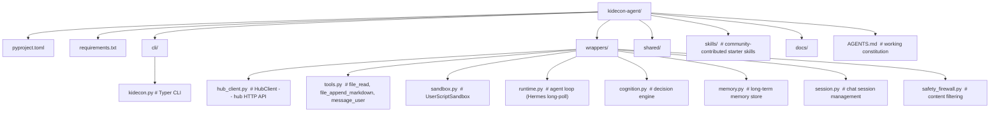

# KidEconomy Agent

The user-facing client for the KidEconomy network: a CLI that connects your agent to the hub,
manages API keys, runs approved tools, and executes sandboxed user scripts. **No server,
no database** — it's a client sidecar.

## Quick start

Requires **Python 3.10+** — install it from [python.org](https://python.org) or use
your system package manager.

**Option A — pipx (recommended).** pipx creates an isolated environment for each CLI tool
and puts the command on your PATH automatically. No venv management needed.

```bash
# Install pipx first (one-time)
brew install pipx          # macOS
sudo apt install pipx      # Linux (Debian/Ubuntu)
pip install --user pipx    # any OS with Python

# Then install kidecon
pipx install kidecon-agent
```

After that, `kidecon` is always available in your terminal — no activation steps.

**Option B — pip.** Installs into your current Python environment. **You must create and
activate a virtual environment yourself** to avoid conflicts with system packages:

```bash
python3 -m venv ~/kidecon-env
source ~/kidecon-env/bin/activate
pip install kidecon-agent
```

Remember to `source ~/kidecon-env/bin/activate` in every new terminal before using `kidecon`.

### Next steps

```bash
kidecon init                         # create default config
kidecon setup --name my-agent        # register with hub → JWT in keyring
kidecon key add --name openrouter    # store an API key
kidecon doctor                       # diagnostic: Python, keyring, hub, JWT, sandbox
kidecon start                        # launch the agent loop
```

See [docs/ONBOARDING.md](docs/ONBOARDING.md) for the full walkthrough.

## CLI reference

```bash
kidecon --help
kidecon init              # create or update configuration
kidecon setup             # register with hub (links KidEconomy account)
kidecon start             # launch the agent loop
kidecon stop              # mark agent offline
kidecon status            # agent id, registration, tier
kidecon tier              # current capability tier
kidecon key add           # store an API key in keyring
kidecon key list          # show stored keys (masked)
kidecon key remove        # delete a key
kidecon doctor            # diagnostic: Python, keyring, hub, JWT, sandbox
kidecon update            # git pull + pip install (dev build)
kidecon skills discover   # query the hub skill directory
kidecon skills submit     # submit a skill for approval
kidecon skills mine       # list your submitted skills
kidecon skills inspect    # full evaluation detail for a skill
kidecon skills template   # generate a skill JSON template
kidecon admin skills      # manage skills (staff only)
kidecon admin agents      # manage agents (staff only)
```

## Layout



## Docs

- [Onboarding](docs/ONBOARDING.md) — install + setup walkthrough.
- [Architecture](docs/ARCHITECTURE.md) — client topology and component responsibilities.
- [Roadmap](docs/ROADMAP.md) — phased plan.
- [AGENTS.md](AGENTS.md) — working constitution for AI agents editing this repo.

## Notes

- `UserScriptSandbox` is a permission gate, not a real sandbox. See `AGENT_NETWORK_REFERENCE.md` §1.5.
- Secrets live in your OS keyring (macOS Keychain, Linux libsecret), never on disk.