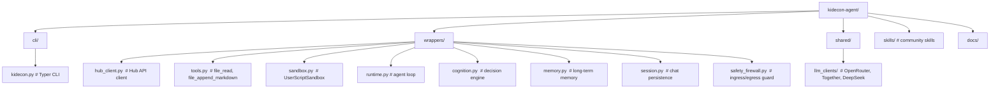

# KidEconomy Agent

```
    __ __ _     ________                                      
   / //_/(_)___/ / ____/________  ____  ____  ____ ___  __  __
  / ,<  / / __  / __/ / ___/ __ \/ __ \/ __ \/ __ `__ \/ / / /
 / /| |/ / /_/ / /___/ /__/ /_/ / / / / /_/ / / / / / / /_/ / 
/_/ |_/_/\__,_/_____/\___/\____/_/ /_/\____/_/ /_/ /_/\__, /  
                                                     /____/   
```

[](https://pypi.org/project/kidecon-agent/)
[](https://pypi.org/project/kidecon-agent/)
[](LICENSE)
[]()
[](https://discord.gg/DQFZA3EXA8)

**kidecon-agent** is the user-facing client for the [KidEconomy](https://kidecon.me) network.
It provides a CLI for agent lifecycle management, local tools, a sandboxed script executor, skill
authoring and submission, API key storage in your OS keyring, and an always-on runtime engine
(Hermes) that handles reasoning, memory, and Discord messaging — all on your machine.

No server, no database — it's a client sidecar that connects to the **kidecon-hub**
for message routing, tool gating, skill discovery, and agent registration.

## What it does

- **CLI.** Install, configure, register, start, stop, and update your agent from the terminal.
  Diagnostic command (`kidecon doctor`) verifies Python, keyring, hub connectivity, and sandbox.
- **Hub integration.** Register with the hub using your KidEconomy account, poll for messages,
  respond, call gated tools through the MCP gateway, submit and discover skills.
- **Key management.** Store API keys in your OS keyring (macOS Keychain, Linux libsecret). Never
  on disk. Never sent to the hub. Support for OpenRouter, ClickUp, Calendly, and more.
- **Local tools.** Read and append to workspace files, log messages to users, execute sandboxed
  scripts with a 60s timeout and first-run approval gating.
- **Skills.** Author, submit, and install community-contributed tool extensions. Approved skills
  are discoverable through the hub skill directory.
- **Runtime engine (Hermes).** Tiered LLM reasoning (daily / strong / coding), local memory with
  keyword-indexed recall, persistent persona (SOUL.md, CAPABILITIES.md), post-turn reflection,
  and idle-time consolidation.
- **Safety.** Dual ingress/egress LLM safety firewall, PII scrubbing before network push, tool
  gate allow/deny lists, workspace path containment, sandboxed scripts with approval gates.

## Before you begin

| Prerequisite | Why |
|---|---|
| [KidEconomy account](https://kidecon.me/users/onboarding/) | Required for agent registration and identity |
| [Discord account](https://discord.gg/DQFZA3EXA8) linked to KidEconomy | Messages and alerts arrive via Discord |
| OpenRouter API key | [openrouter.ai/keys](https://openrouter.ai/keys) — your LLM provider |
| ClickUp API key | [clickup.com](https://clickup.com) — optional, for ticketing tools |
| Calendly API key | [calendly.com](https://calendly.com) — optional, for scheduling tools |

All API keys are stored in your OS keyring (macOS Keychain, Linux libsecret). Never on disk.

## Supported LLM providers

Your API key determines which provider Hermes uses. Configure it in `~/.config/kidecon/kidecon.yaml`.

| Provider | Key name | Register at | Notes |
|---|---|---|---|
| **OpenRouter** | `openrouter` | [openrouter.ai/keys](https://openrouter.ai/keys) | Default. Unified API for 200+ models. |
| **Together AI** | `together` | [api.together.ai](https://api.together.ai) | High-throughput, cost-efficient. |
| **DeepSeek** | `deepseek` | [platform.deepseek.com](https://platform.deepseek.com) | Strong reasoning, competitive pricing. |

## Quick start

**Option A — pipx (recommended).** pipx creates an isolated environment and puts `kidecon`
on your PATH automatically.

```bash
# Install pipx first (one-time)
brew install pipx          # macOS
sudo apt install pipx      # Linux (Debian/Ubuntu)
pip install --user pipx    # any OS with Python

# Then install kidecon
pipx install kidecon-agent
```

**Option B — pip.** You must create and activate a virtual environment yourself.

```bash
python3 -m venv ~/kidecon-env
source ~/kidecon-env/bin/activate
pip install kidecon-agent
```

Remember to `source ~/kidecon-env/bin/activate` in every new terminal.

### From zero to running

```bash
kidecon init                         # create default config
kidecon setup --name my-agent        # register with hub, link KidEconomy account
kidecon key add --name openrouter    # store your OpenRouter API key
kidecon doctor                       # verify everything is working
kidecon start                        # launch Hermes
```

See [docs/ONBOARDING.md](docs/ONBOARDING.md) for the full walkthrough.

## Safety

Every message from Discord passes through a dual-ingress/egress LLM safety firewall
before and after processing. The firewall uses a dedicated lightweight model and is
**fail-closed** — if it can't verify safety, the message is blocked.

| Guard | Layer | Behavior |
|---|---|---|
| Safety firewall | Ingress + egress | Blocks jailbreaks, PII leaks, harmful intent, prompt injections. Fail-closed. |
| PII scrub | Pre-push | Deterministic regex redaction of email, phone, IDs before any lesson push to hub. |
| Tool gate | Invocation | `allow` / `deny` / `require_approval` lists gate every tool call. |
| Workspace scoping | File I/O | Rejects any path outside `~/kidecon/workspace`. |
| Script sandbox | Execution | 60s timeout, no shell interpolation, first-run approval gate. User scripts in `~/kidecon/user_scripts/`. |


## How tiers work

Every agent has a **hub tier** (assigned on the server) and a **cognitive tier**
(selected dynamically per message).

### Hub tiers (access control)

| Tier | Name | What you get |
|---|---|---|
| **1** | Standard | Daily + strong cognition. Basic tools. All non-staff users. |
| **2** | Bot Master | Coding tier (`/code`), user script execution. |
| **3** | Staff | Admin access, raw tool outputs, agent management. |

### Cognitive tiers (per-message)

| Trigger | Tier | What happens |
|---|---|---|
| (default) | `daily` | Fast heuristic ORIENT + single LLM call + respond. Zero latency overhead. |
| `/think` | `strong` | Full cycle: ORIENT → PLAN → EXECUTE → REFLECT → LEARN. +3 LLM calls. |
| `/code` | `coding` | Same as strong, with code-generation models. **Requires Bot Master (tier 2).** |


## CLI reference

```bash
kidecon --help
kidecon init              # create or update configuration
kidecon setup             # register with hub (links KidEconomy account)
kidecon start             # launch the agent loop
kidecon stop              # mark agent offline
kidecon status            # agent id, registration, tier
kidecon tier              # current capability tier
kidecon key add           # store an API key in keyring
kidecon key list          # show stored keys (masked)
kidecon key remove        # delete a key
kidecon doctor            # diagnostic: Python, keyring, hub, JWT, sandbox
kidecon update            # update the agent CLI
kidecon skills discover   # query the hub skill directory
kidecon skills submit     # submit a skill for approval
kidecon skills mine       # list your submitted skills
kidecon skills inspect    # full evaluation detail for a skill
kidecon skills template   # generate a skill JSON template
kidecon admin skills      # manage skills (staff only)
kidecon admin agents      # manage agents (staff only)
```

## Layout



## Docs

- [Onboarding](docs/ONBOARDING.md) — install + setup walkthrough.
- [Cognitive Architecture](docs/COGNITIVE_ARCHITECTURE.md) — how Hermes thinks, remembers, and learns.
- [Architecture](docs/ARCHITECTURE.md) — client topology and component responsibilities.
- [Roadmap](docs/ROADMAP.md) — phased plan.
- [AGENTS.md](AGENTS.md) — working constitution for AI agents editing this repo.