# KidEconomy Agent

The user-facing client for the KidEconomy network: a thin CLI + Python library that installs Hermes (from Nous Research), places the KidEconomy config, registers your agent with the hub, and provides approved local tools plus a sandboxed user-script executor. **No server, no database** — it's a client sidecar.

## What it does

- **`install.sh`** — one-command bootstrap: venv, deps, config placement, keyring setup, hub registration.
- **`kidecon` CLI** — lifecycle management: `setup`, `start`, `stop`, `status`, `update`, `key`, `tier`, `skills`.
- **Wrappers** — `HubClient` (hub HTTP API), `tools` (workspace-scoped local tools), `UserScriptSandbox` (isolated subprocess execution with a 60s timeout and first-run approval).
- **Secrets in keyring** — API keys and the hub JWT are stored in the OS keyring, never on disk.

## Quick start

```bash
git clone <repo-url> kidecon-agent
cd kidecon-agent
bash install.sh
```

Prerequisites: **Python 3.14** (`python3.14` on PATH) and a reachable **kidecon-hub** (default `http://localhost:8000`; change `hub_url` in `kidecon.yaml` for production).

## CLI

```bash
python cli/kidecon.py --help
python cli/kidecon.py setup --name my-agent      # register with hub → JWT in keyring
python cli/kidecon.py status                     # agent id, registration, tier
python cli/kidecon.py tier                       # current capability tier
python cli/kidecon.py key add                    # store an API key in keyring
python cli/kidecon.py key list                   # masked key listing
python cli/kidecon.py doctor                     # diagnostic: Python, keyring, hub, JWT, sandbox
python cli/kidecon.py start                      # verify hub + JWT, mark online
python cli/kidecon.py stop                       # mark offline, cleanup
python cli/kidecon.py update                     # git pull + pip install (or re-run install.sh)
python cli/kidecon.py skills list                # installed skills
python cli/kidecon.py skills browse <query>      # query the hub skill directory
```

## Layout

```mermaid
flowchart TD
    root["kidecon-agent/"]
    root --> install["install.sh  # bootstrap script"]
    root --> kyaml["kidecon.yaml  # default config (provider, hub_url, tool_gate, ...)"]
    root --> reqs["requirements.txt"]
    root --> pyproj["pyproject.toml  # ruff (py314) + pytest"]
    root --> cli["cli/"]
    cli --> cliinit["__init__.py"]
    cli --> clicli["kidecon.py  # Click CLI"]
    root --> wrappers["wrappers/"]
    wrappers --> wrinit["__init__.py"]
    wrappers --> hubclient["hub_client.py  # HubClient -- hub HTTP API"]
    wrappers --> tools["tools.py  # file_read, file_append_markdown, message_user"]
    wrappers --> sandbox["sandbox.py  # UserScriptSandbox"]
    root --> skills["skills/  # community-contributed starter skills"]
    root --> docs["docs/"]
    docs --> docsarch["ARCHITECTURE.md"]
    docs --> docsroad["ROADMAP.md"]
    docs --> docsonb["ONBOARDING.md"]
    docs --> docsckpt["checkpoints/"]
    root --> agentsmd["AGENTS.md  # working constitution for AI agents"]
    root --> kilo[".kilo/  # Kilo agent directives + config"]
```



## Docs

- [Onboarding](docs/ONBOARDING.md) — install + setup walkthrough.
- [Architecture](docs/ARCHITECTURE.md) — client topology and component responsibilities.
- [Roadmap](docs/ROADMAP.md) — phased plan.
- [AGENTS.md](AGENTS.md) — working constitution for AI agents editing this repo.

## Notes

- Hermes installation is currently **stubbed** — the real Nous Research repo URL is TBD.
- The hub skill-submission endpoint is TBD; `publish_skill` is a stub.
- `UserScriptSandbox` is a permission gate, not a real sandbox. See `AGENT_NETWORK_REFERENCE.md` §1.5.

## Lifecycle Test Results (2026-07-06)

All phases tested against the live hub at `https://hub.kidecon.me`:

| Phase | Status | Detail |
|-------|--------|--------|
| 1. Install & Bootstrap | ✓ | `kidecon` on PATH in venv, `kidecon.yaml` at `~/.config/kidecon/`, `--help` shows 9 subcommands |
| 2. Agent Registration | ✓ | `setup` stores JWT + agent_id in keyring; `status` shows ID/registered/tier=1 |
| 3. Key Management | ✓ | `key add` stores in keyring; `key list` shows masked values |
| 4. Hub Communication | ✓ | `hub_call("test_kideconomy_api")` → `{status: "ok", error: null}`; tier-2 tool correctly 403-blocked |
| 5. Message Poll Loop | ✓ | Poll → 0 messages; send → poll catches message; respond → status=accepted |
| 6. Skill Discovery | ✓ | `discover_skills("")` returns empty array (no approved skills — expected) |
| 7. Local Tools | ✓ | `file_read`/`file_append_markdown` works; path traversal blocked; `message_user` writes to `~/kidecon/messages.log` |
| 8. Sandbox | ✓ | First-run blocks without approval; `auto_approve=True` works; 60s timeout enforced |
| 9. Missing Pieces | ✓ | `doctor` (10 checks), `start` (hub+JWT verify), `stop` (hub offline update), `update` (git pull) all functional |
| 10. Known Bugs | ✓ | `tools.py`: `is_relative_to` path containment; `sandbox.py`: security prefix + timestamped audit; `install.sh`: `$VENV_DIR` fix + `chmod +x` |
