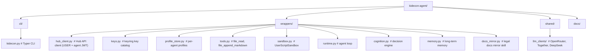

# KidEconomy Agent

```
    __ __ _     ________                                      
   / //_/(_)___/ / ____/________  ____  ____  ____ ___  __  __
  / ,<  / / __  / __/ / ___/ __ \/ __ \/ __ \/ __ `__ \/ / / /
 / /| |/ / /_/ / /___/ /__/ /_/ / / / / /_/ / / / / / / /_/ / 
/_/ |_/_/\__,_/_____/\___/\____/_/ /_/\____/_/ /_/ /_/\__, /  
                                                     /____/   
```

[](https://pypi.org/project/kidecon-agent/)
[](https://pypi.org/project/kidecon-agent/)
[](LICENSE)
[]()
[](https://discord.gg/DQFZA3EXA8)

**kidecon-agent** is the user-facing client for the [KidEconomy](https://kidecon.me) network.
It provides a CLI for agent lifecycle management, local tools, a sandboxed script executor, skill
authoring and submission, API key storage in your OS keyring, and an always-on runtime engine
(Hermes) that handles reasoning, memory, and Discord messaging — all on your machine.

No server, no database — it's a client sidecar that connects to the **kidecon-hub**
for message routing, tool gating, skill discovery, and agent registration.

> **This README is the canonical onboarding guide.** It's written so that if you point an LLM at
> this repo, it can walk any user from zero to a running, Discord-linked, skill-equipped agent.
> Follow the [Quick start](#quick-start) in order — each step prints what you should see.

---

## The 30-second tour

```
> The world hums with possibility...
> Light finds its way through the code...
> Your companion awakens...
> The road ahead is open.

╭──────────────────────────────────────────╮
│                                          │
│    __ __ _     ________                   │
│   / //_/(_)___/ / ____/...               │
│                                          │
╰──────────────────────────────────────────╯

Are you ready to go! >_
```

That's the `kidecon` splash — what every new user sees on first run. The flow behind it, end to end:

```
install → init → authenticate → add keys → create agent → doctor → start → talk via Discord
```

You'll create a **KidEconomy account** (a *user*), attach one or more **agents** to it, and each
agent runs on your machine and talks to you through Discord. Your **account** is you; your
**agents** are compute surfaces you own. (See [Identity: account vs agent](#identity-account-vs-agent).)

---

## Before you begin — gather these first

The single biggest onboarding friction is discovering a missing key mid-flow. **Collect all of
these before you run `kidecon init`** so the rest is butter.

| What | Why | Where to get it | Key name |
|---|---|---|---|
| **KidEconomy account** | Your identity on the network. Agents belong to your account. | [kidecon.me/users/onboarding](https://kidecon.me/users/onboarding/) | — (username + password) |
| **Discord linked to KidEconomy** | The agent reaches you *only* through Discord DMs. Link your Discord in your KidEconomy profile **before** starting the agent. | [discord.gg/DQFZA3EXA8](https://discord.gg/DQFZA3EXA8), then link in KE settings | — (account-level) |
| **OpenRouter API key** | **Required.** The LLM provider the agent boots with. Without it the agent exits immediately at start. | [openrouter.ai/keys](https://openrouter.ai/keys) | `openrouter` |
| GitHub PAT (read-only) | Only for the `docs-mirror` skill (staff). Fine-grained, read-only, scoped to the protocol docs repo. | [github.com/settings/tokens](https://github.com/settings/tokens) (fine-grained) | `github-docs` |
| Lexor key | Only for the Lexor legal MCP (staff). | from your Lexor admin | `lexor` |

> **Tips for a smooth start**
> - Link Discord to your KidEconomy account **first** — the mint step (`kidecon authenticate`)
>   pulls your Discord handle in automatically; if it's not linked yet you can re-run authenticate
>   after linking.
> - Have your **OpenRouter key ready before `kidecon start`** — the runtime fails fast if it's
>   missing (by design, so you don't get a silently-broken agent).
> - All keys live in your **OS keyring** (macOS Keychain / Linux libsecret). Never written to disk,
>   never sent to the hub.

### Supported LLM providers

Your API key determines which provider Hermes uses. Configure the provider name in
`~/.config/kidecon/kidecon.yaml` under `llm.provider` (default `openrouter`).

| Provider | Key name | Register at | Notes |
|---|---|---|---|
| **OpenRouter** | `openrouter` | [openrouter.ai/keys](https://openrouter.ai/keys) | Default. Unified API for 200+ models. **Required to boot.** |
| Together AI | `together` | [api.together.ai](https://api.together.ai) | High-throughput, cost-efficient. |
| DeepSeek | `deepseek` | [platform.deepseek.com](https://platform.deepseek.com) | Strong reasoning, competitive pricing. |

---

## Quick start

### 1. Install

**Option A — pipx (recommended).** Isolated environment, `kidecon` on your PATH.

```bash
# Install pipx first (one-time)
brew install pipx            # macOS
sudo apt install pipx       # Linux (Debian/Ubuntu)
pip install --user pipx     # any OS with Python

pipx install kidecon-agent
```

**Option B — pip (editable, for developers).**

```bash
git clone git@github.com:kideconomy/kidecon-agent.git
cd kidecon-agent
python3 -m venv .venv && source .venv/bin/activate
pip install -e .
```

> In a pip environment, remember to `source .venv/bin/activate` in each new terminal.

### 2. Initialize (point at the hub + KE)

```bash
kidecon init
```

Writes `~/.config/kidecon/kidecon.yaml`. Defaults to the **public** hub (`https://hub.kidecon.me`)
and KidEconomy (`https://kidecon.me`). You'll see the splash screen, then the config summary.

### 3. Authenticate (log in to KidEconomy + mint your account token)

```bash
kidecon authenticate
# KidEconomy username: ***REMOVED***
# KidEconomy password: ********
# ✓ Authenticated as ***REMOVED***.
# Account token stored — `kidecon status --me` works without --agent.
```

This logs you into KidEconomy (verifying your DRF token) and mints a **USER JWT** — an
account-level token that lets you check your own status **without naming an agent**. It also pulls
in your Discord handle if it's linked on your KE account.

### 4. Add your keys (before you start the agent)

```bash
kidecon key add --name openrouter --value <your-openrouter-key>     # REQUIRED — agent won't boot without it
kidecon key add --name github-docs --value <your-github-pat>        # staff only, for docs-mirror
kidecon key list                                                    # show stored keys (masked)
```

### 5. Create your agent

```bash
kidecon agents create --name my-agent --role standalone
# ✓ Agent 'my-agent' created and registered.
#   Role: standalone | Agent ID: <uuid>
#   Next: kidecon start --name my-agent
```

Roles: `standalone` (a single self-sufficient agent) · `worker` · `orchestrator` (owns Discord
listening in a multi-agent setup; creating one auto-demotes standalones to workers).

### 6. Doctor (verify everything is wired)

```bash
kidecon doctor
```

Checks Python, keyring, config, hub connectivity, required keys, and the sandbox. Fix any FAIL
before starting.

### 7. Start the agent

```bash
kidecon start --name my-agent --background     # background daemon
# or
kidecon start --name my-agent                  # foreground; Ctrl+C to stop
```

You should see:

```
✓ Hermes booting — tier 3, hub https://hub.kidecon.me, agent my-agent (standalone)
Long-polling for messages... (Ctrl+C to stop)
```

Once it's long-polling, the agent is **online**. DM the KidEconomy Discord bot and your message
routes to this agent.

**Logs / control:**
```bash
tail -f ~/kidecon/logs/my-agent.log     # live logs
kidecon agents stop --name my-agent      # stop a background agent
kidecon agents logs --name my-agent      # tail the log
kidecon agents status --name my-agent    # is it running?
```

### 8. (Staff) Install a skill

Skills are opt-in tool extensions discovered through the hub. `docs-mirror` (staff, tier 3) clones
the legal protocol docs into your workspace so the agent can read them locally.

```bash
kidecon --agent my-agent skills list            # see Installed vs Available
kidecon --agent my-agent skills install docs-mirror
kidecon --agent my-agent skills list            # now under Installed
kidecon agents stop --name my-agent             # boot-time skills need one restart
kidecon start --name my-agent --background      # docs-mirror clones on boot
ls ~/kidecon/workspace/legal-docs               # the mirrored docs
```

> Note the `--agent my-agent` flag — **skill commands are agent-scoped** (they use the agent's
> JWT), unlike `status --me`/`--refresh` which are account-scoped (your USER JWT, no `--agent`).

---

## Talk to your agent

Once `kidecon start` shows "Long-polling for messages...", your agent is **online**. You talk to it
through Discord — it has no other chat surface.

1. **Open Discord** and DM the **KidEconomy** bot (the same one linked to your KidEconomy account).
2. Just type a message. The agent reads it, reasons, and replies in the same DM.
3. Use these **slash commands** in the DM to change how hard it thinks:

   | Command | Effect |
   |---|---|
   | (plain message) | Fast, single-pass reply (`daily`). Best for most things. |
   | `/think <message>` | Deep reasoning — full plan → execute → reflect → learn cycle (`strong`). Use for hard questions. |
   | `/code <message>` | Like `/think`, but with code-generation models (`coding`). **Requires Bot Master (tier 2).** |

That's the whole loop: DM the bot → it replies. If the bot says "agent is offline," the agent
process isn't running — `kidecon agents status --name <n>` to check, `kidecon start --name <n>
--background` to bring it back.

---

## Identity: account vs agent

This is the model, and it's worth getting right:

| | **Account (User)** | **Agent** |
|---|---|---|
| What it is | Your KidEconomy identity | A compute surface attached to your account |
| Token | **USER JWT** (`type="user"`, `sub=User.id`, per-user secret) | **Agent JWT** (no `type`, `sub=Agent.id`, per-agent secret) |
| Minted by | `POST /api/user/token` (from a verified KE DRF token) | `POST /api/register_agent` (agent registration) |
| Used for | `kidecon status --me`, `kidecon status --refresh` | tools, messages, skills, agent status |
| CLI flag | none (uses the stored USER JWT) | `--agent <name>` (or `--name` for `start`/`status`/`stop`) |

- `kidecon status --me` / `--refresh` run **with no `--agent`** — they authenticate as your account.
- `kidecon status --me --agent my-agent` still works (compat) — it resolves that agent's owning
  account.
- The two token kinds are cryptographically separated: a USER JWT can never authorize agent ops,
  and an agent JWT never takes the account path.

---

## Daily commands

```bash
kidecon status --me                         # your account (no --agent)
kidecon status --refresh                    # re-verify against KE, pull fresh profile
kidecon status --name my-agent              # this agent's hub status
kidecon agents list                         # all local profiles
kidecon key list                            # stored keys (masked)
kidecon doctor                              # health check
kidecon update                              # update the CLI
```

## CLI reference

```bash
kidecon --help
kidecon init                               # create or update configuration
kidecon authenticate                       # log in to KidEconomy; mints USER JWT
kidecon agents create --name <n> --role <r># create + register an agent
kidecon agents list                        # list local agent profiles
kidecon agents delete --name <n>           # delete a profile (+ deactivate on hub)
kidecon agents stop --name <n>             # stop a background agent
kidecon agents logs --name <n>             # tail the agent log
kidecon agents status --name <n>           # running? PID, status
kidecon start --name <n> [--background]    # launch the agent loop
kidecon status [--me | --name <n>]         # account or agent status
kidecon status --refresh                   # re-verify account against KE
kidecon key add --name <provider>          # store an API key in keyring
kidecon key list                           # show stored keys (masked)
kidecon key remove --name <provider>       # delete a key
kidecon doctor                             # diagnostics: Python, keyring, hub, keys, sandbox
kidecon update                             # update the agent CLI
kidecon --agent <n> skills list            # installed vs available skills
kidecon --agent <n> skills discover [q]    # search the hub skill directory
kidecon --agent <n> skills install <name>  # install a skill (local opt-in)
kidecon --agent <n> skills uninstall <name># remove a skill
kidecon --agent <n> skills inspect <id>    # full skill detail
kidecon --agent <n> skills submit --file <skill.yaml>  # submit a skill for approval
kidecon --agent <n> skills mine             # your submitted skills
kidecon --agent <n> skills template        # generate a skill manifest template
kidecon admin --help                       # staff-only admin (tier 3)
kidecon panic --force                      # wipe all local agent data (destructive)
```

**Admin commands** require a **tier-3 staff agent** and are audited hub-side:
```bash
kidecon admin users --help       # list | ban | unban
kidecon admin agents --help      # list | promote | staff | unstaff | delete
kidecon admin skills --help      # pending | approve | reject | embed
```

---

## How tiers work

Every agent has a **hub tier** (server-assigned access control) and a **cognitive tier**
(selected per message).

### Hub tiers (access control)

| Tier | Name | What you get |
|---|---|---|
| **1** | Standard | Daily + strong cognition. Basic tools. All non-staff users. |
| **2** | Bot Master | Coding tier (`/code`), user script execution. |
| **3** | Staff | Admin access, raw tool outputs, staff-only skills (`docs-mirror`, `lexor`). |

### Cognitive tiers (per-message)

| Trigger | Tier | What happens |
|---|---|---|
| (default) | `daily` | Fast heuristic ORIENT + single LLM call + respond. Zero latency overhead. |
| `/think` | `strong` | Full cycle: ORIENT → PLAN → EXECUTE → REFLECT → LEARN. +3 LLM calls. |
| `/code` | `coding` | Same as strong, with code-generation models. **Requires Bot Master (tier 2).** |

---

## Safety

Every message from Discord passes through a dual-ingress/egress LLM safety firewall before and
after processing. The firewall uses a dedicated lightweight model and is **fail-closed** — if it
can't verify safety, the message is blocked.

| Guard | Layer | Behavior |
|---|---|---|
| Safety firewall | Ingress + egress | Blocks jailbreaks, PII leaks, harmful intent, prompt injections. Fail-closed. |
| PII scrub | Pre-push | Deterministic regex redaction of email, phone, IDs before any network push. |
| Tool gate | Invocation | `allow` / `deny` / `require_approval` lists gate every tool call. |
| Workspace scoping | File I/O | Rejects any path outside `~/kidecon/workspace`. |
| Script sandbox | Execution | 60s timeout, no shell interpolation, first-run approval gate. User scripts in `~/kidecon/user_scripts/`. |

Non-staff users (adults and children alike) have an **identical** experience — content filtering,
tool gating, and sandbox restrictions apply uniformly. Staff (tier 3) is the only exception.

---

## Troubleshooting

| Symptom | Fix |
|---|---|
| `No API key for 'openrouter' in keyring` at start | `kidecon key add --name openrouter --value <key>` — it's required to boot. |
| `status --me` shows the "several profiles — pick one" hint | No USER JWT stored. Run `kidecon authenticate` to mint one (it survives agent resets). |
| `status --refresh` says "KidEconomy unreachable or not configured" | The hub's `KIDECONOMY_API_KEY` is unset on the server. Refresh is fail-safe; the mint path (`authenticate`) still works and pulls Discord. Ask your hub admin to set the key. |
| `docs-mirror` didn't clone | `github-docs` PAT missing or lacks repo access. `kidecon key add --name github-docs --value <pat>` (fine-grained, read-only, scoped to the docs repo), then restart the agent. |
| Discord bot says "agent is offline" | The agent isn't running. `kidecon agents status --name <n>`; if stopped, `kidecon start --name <n> --background`. |
| Agent 401s (JWT expired) | The runtime auto-renews the **agent** JWT from the stored KE token. If that fails, re-run `kidecon agents create --name <n>` to re-register. For the **USER JWT**, re-run `kidecon authenticate` to mint a fresh one. |

---

## Layout


```mermaid
flowchart TD
    root["kidecon-agent/"]
    root --> cli["cli/"]
    cli --> clicli["kidecon.py  # Typer CLI"]
    root --> wrappers["wrappers/"]
    wrappers --> hubclient["hub_client.py  # Hub API client (USER + agent JWT)"]
    wrappers --> keys["keys.py  # keyring key catalog"]
    wrappers --> profile_store["profile_store.py  # per-agent profiles"]
    wrappers --> tools["tools.py  # file_read, file_append_markdown"]
    wrappers --> sandbox["sandbox.py  # UserScriptSandbox"]
    wrappers --> runtime["runtime.py  # agent loop"]
    wrappers --> cognition["cognition.py  # decision engine"]
    wrappers --> memory["memory.py  # long-term memory"]
    wrappers --> docs_mirror["docs_mirror.py  # legal docs mirror skill"]
    root --> shared["shared/"]
    shared --> llm["llm_clients/  # OpenRouter, Together, DeepSeek"]
    root --> docs["docs/"]
```

## Docs

- [Onboarding](docs/ONBOARDING.md) — full install + setup walkthrough.
- [Cognitive Architecture](docs/COGNITIVE_ARCHITECTURE.md) — how Hermes thinks, remembers, and learns.
- [Architecture](docs/ARCHITECTURE.md) — client topology and component responsibilities.
- [Roadmap](docs/ROADMAP.md) — phased plan.
- [AGENTS.md](AGENTS.md) — working constitution for AI agents editing this repo (LLMs: read this
  first when working in the code).

---

## License

MIT. See [LICENSE](LICENSE).
