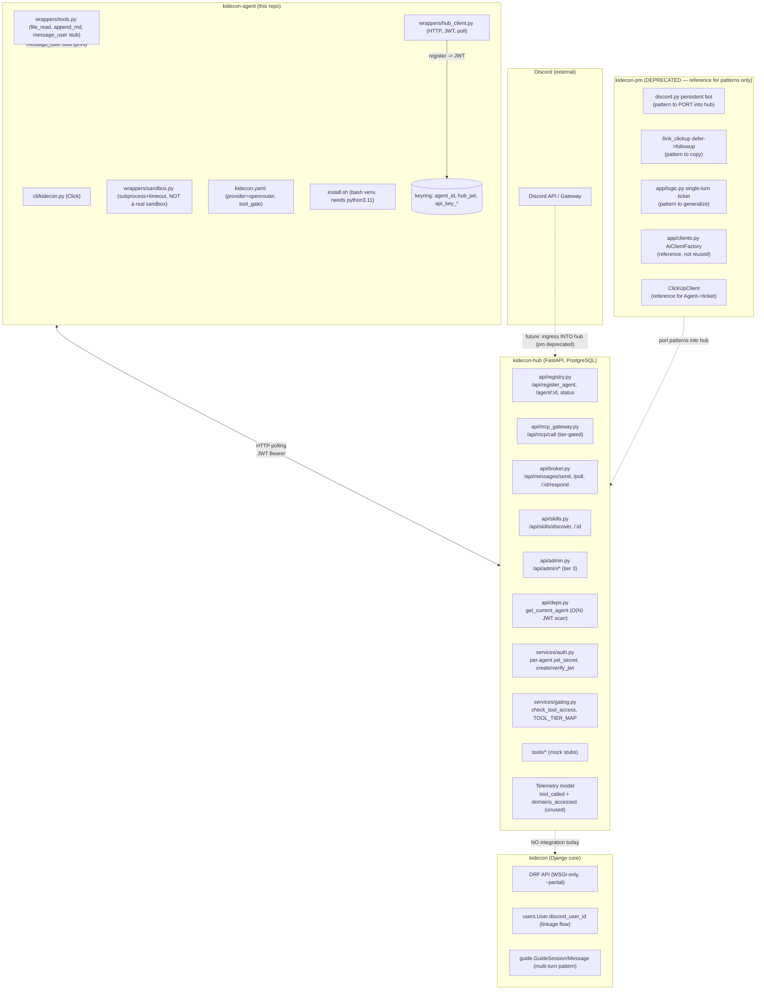

# Agent Network Reference & Gap Analysis

**Audience:** engineers building and integrating `kidecon-agent` (the Edge CLI).
**Purpose:** a working, exhaustive reference that (a) maps every component that already exists across the four relevant repositories, (b) defines what `kidecon-agent` must build or change, and (c) covers Discord fallback strategies, non-technical-user ("normie") UX, installation paths, and the containerization-vs-executable trade-off in full depth.
**Status:** Living document. Update when components, contracts, or fallback policy change.

---

## 0. How to read this document

### 0.1 The four repositories that matter

| Repo | Path | Role | Status |
|---|---|---|---|
| `kidecon` | `source/kidecon` | Django/DRF core — system of record (users, tribes, contracts, wallets, guide bot, quest engine). Source of identity and governed state. Holds `users.User.discord_user_id`. | Live, WSGI-only |
| `kidecon-hub` | `source/kidecon-hub` | FastAPI + SQLAlchemy async + PostgreSQL — the **learning hub**: central MCP gateway, agent registry, A2A message broker, skill directory, telemetry store. The service through which application users learn AI and work with bots. This is the service `kidecon-agent` talks to. | Live scaffold, no Discord |
| `kidecon-agent` | `source/kidecon-agent` (this repo) | **All end-user tools for local installation** — the Edge CLI (Click) + wrappers that run on each user's laptop. Installs Hermes, places config, registers with the hub, runs local tools + a sandboxed user-script executor. No server, no database. | Live scaffold, many stubs |
| `kidecon-pm` | `source/kidecon-pm` | **Deprecated** legacy Discord bot — FastAPI + `discord.py` that created ClickUp tickets from `@mentions`. Kept only as a *reference for proven patterns* (persistent `bot.start()` in a FastAPI lifespan, slash-command `defer`→`followup`, structured extraction). Not a component to bridge to or extend. | Deprecated, reference-only |

> **Critical clarifications:**
> 1. `kidecon-hub` is the **learning hub** — its purpose is to help application users learn AI and work with bots, mediated by agents registered from `kidecon-agent`. This makes the access control and safety surface central (§4.5), not peripheral.
> 2. `kidecon-agent` provides **all end-user local tools**; the hub is the central learning/governance service; the two are separate repos with an HTTP contract (§2.2).
> 3. `kidecon-pm` is **deprecated**. Any future Discord ingress belongs in `kidecon-hub`, not `kidecon-pm`. The pm bot's working patterns are worth porting, but it is not a live component of the agent network.

### 0.2 The central organizing constraint

Every architectural decision in `kidecon-agent` flows from one fact: **the laptop is behind NAT and offline most of the time.** Therefore:
- The laptop cannot be reached inbound → it must reach out to the hub. Today the only channel is **HTTP polling** (`kidecon-agent` `wrappers/hub_client.py:poll_messages` → `kidecon-hub` `api/broker.py` `/api/messages/poll`). A persistent outbound WebSocket is a *proposed* evolution, not a built feature (see §1.7).
- Discord ingress, if/when wired, is **not** on the laptop → it is a hub-side process. `kidecon-pm` had a working Discord bot but is **deprecated**; any future Discord surface belongs in `kidecon-hub`, porting pm's patterns.
- A morning digest, if/when built, must be **hub-computed** so it is available on a phone with the laptop closed.

**Mission framing.** The hub's purpose is to help application users **learn AI and work with bots**; `kidecon-agent` gives those users (and the business-team Bot Masters who operate on their behalf) the local tools. This reframes the network effects (skill surfacing, A2A) as a *learning* loop, and puts access control & safety at the center (§4.5). All non-staff users (adults and children) have identical access; staff (tier 3) is the only exception.

### 0.3 What `kidecon-agent`'s own AGENTS.md already mandates (do not regress)

From this repo's `AGENTS.md`:
- Stack: Python 3.11, Click, httpx, keyring, PyYAML. **No server, no database.**
- Secrets: **OS keyring only**, never on disk.
- Config: `kidecon.yaml` (YAML).
- Sandbox must enforce: no filesystem access outside designated dirs, 60s timeout, first-run approval.
- Every `.py` file starts with `import logging; logger = logging.getLogger(__name__)`.
- No commits unless explicitly requested.

This reference respects those rules. Where this document proposes something that would require relaxing them (e.g. a real seccomp sandbox, a WebSocket daemon, a native installer pipeline), it is flagged explicitly as a **scope expansion** requiring a documented decision.

---

## 1. Full architectural outline

### 1.1 System topology (current, as-built)

> **Intelligence boundary:** Hermes + OpenRouter live on the edge (laptop). The hub is a coordinator, not an agent. See `kidecon-hub/docs/FLOW_CONTROL.md` §9 for the full agent decision tree and `kidecon-hub/docs/ARCHITECTURE.md` §5 for the hub's LangChain architecture.



### 1.2 Component inventory — what exists, where, status

| Component | Repo | File:line | Status | Role for `kidecon-agent` |
|---|---|---|---|---|
| Agent registry + JWT issue | `kidecon-hub` | `api/registry.py:71`, `services/auth.py:28` | Live | `kidecon-agent` `HubClient.register()` calls this; receives JWT |
| Per-agent JWT (random secret) | `kidecon-hub` | `services/auth.py:18-25` | Live | Stateless; agent re-registers to rotate |
| Auth dependency (O(N) scan) | `kidecon-hub` | `api/deps.py:25-33` | Live, **scalability concern** | Loads ALL agents, iterates `verify_jwt` per agent — O(N) per request |
| MCP tool gateway (tier-gated) | `kidecon-hub` | `api/mcp_gateway.py:54-80` | Live, tools are mocks | `HubClient.hub_call()` dispatch target |
| Tool handlers (mock stubs) | `kidecon-hub` | `api/mcp_gateway.py:35-44` | Stubs | `sentry`, `legal`, `calendly`, `kid_economy`, `search_documentation`, `submit_support_ticket` |
| Tier gating | `kidecon-hub` | `services/gating.py`, `api/deps.py:36-41` | Live | `check_tool_access(agent, tool_name)`; `require_tier(N)` |
| A2A message broker (poll model) | `kidecon-hub` | `api/broker.py:35-97` | Live | `send` / `poll` / `respond` — **HTTP polling, not WebSocket** |
| Skill directory | `kidecon-hub` | `api/skills.py:19-55` | Live | `discover` + `/{id}`; approved-only |
| Admin (tier 3) | `kidecon-hub` | `api/admin.py` | Live | Skill approval, tier bumps, telemetry read |
| Telemetry model | `kidecon-hub` | `models.py:73-81` | Live, **domains_accessed unused** | `tool_called` written on every MCP call; `domains_accessed` JSON field exists but never populated |
| `Agent` model | `kidecon-hub` | `models.py:28-41` | Live | id, name, tier, jwt_secret, status, last_seen |
| `Message` model | `kidecon-hub` | `models.py:57-70` | Live | from/to agent, type, payload, reply_to, status |
| Click CLI lifecycle | `kidecon-agent` | `cli/kidecon.py` | Live, stubs | `setup/start/stop/status/update/key/tier/skills` |
| Hub HTTP client | `kidecon-agent` | `wrappers/hub_client.py` | Live | register, hub_call, poll, respond, send, discover, get_tier |
| Local tools | `kidecon-agent` | `wrappers/tools.py` | Live, **weak path check** | `file_read`, `file_append_markdown`, `message_user` (stub: print) |
| User-script sandbox | `kidecon-agent` | `wrappers/sandbox.py:27-54` | Live, **NOT a real sandbox** | `subprocess.run` + 60s timeout + first-run approval; no seccomp/AppArmor, no net-egress block |
| Config | `kidecon-agent` | `kidecon.yaml` | Live | `provider: openrouter`, `tool_gate` allow/deny/require_approval |
| Install bootstrap | `kidecon-agent` | `install.sh` | Live, **normie-unfriendly** | bash venv, requires `python3.11` on PATH |
| Keyring secrets | `kidecon-agent` | `wrappers/hub_client.py:9-12` | Live | `agent_id`, `hub_jwt`, `api_key_<name>` under service `kidecon-agent` |
| Persistent Discord bot | `kidecon-pm` | `main.py:107-113` | **Deprecated** | Pattern to PORT into the hub (lifespan `bot.start()`); do not reuse pm itself |
| Slash command defer→followup | `kidecon-pm` | `main.py:85-104` | **Deprecated** | Pattern to copy when the hub adds Discord |
| `@mention` handler (single-turn) | `kidecon-pm` | `main.py:48-65` | **Deprecated**, dup-handler bug | Reference for the conversational-DM shape; not a component to extend |
| Single-turn ticket logic | `kidecon-pm` | `app/logic.py:28-96` | **Deprecated** | Pattern to generalize into a hub tool |
| Hub-side AI factory | `kidecon-pm` | `app/clients.py:110-134` | **Deprecated** | Reference for structured extraction; hub needs its own client |
| ClickUp client | `kidecon-pm` | `app/clients.py:139-202` | **Deprecated** | Reference for an Agent→ticket hub tool |
| Identity map (JSON file) | `kidecon-pm` | `app/mapping_manager.py` | **Deprecated**, drifts | Do NOT reuse — retire `mappings.json`; resolve identity via `kidecon.users.User.discord_user_id` |
| Discord DM (connect/send/close) | `kidecon` | `users/services.py:84-118` | Live | Reference only; not persistent |
| Discord linkage flow | `kidecon` | `templates/users/profile.html:96-145` | Live | Source of `discord_user_id`; normie-friendly (no dev portal) |
| Multi-turn session pattern | `kidecon` | `guide.GuideSession/GuideMessage` | Live | Pattern to PORT if interactive drafting is built |

### 1.3 `kidecon-hub` — what `kidecon-agent` actually talks to

`kidecon-agent`'s `HubClient` (`wrappers/hub_client.py`) is the single integration point with the hub. Mapped to real endpoints:

| `HubClient` method | Hub endpoint | File:line |
|---|---|---|
| `register(name)` | `POST /api/register_agent` | `api/registry.py:71` |
| `hub_call(tool, params)` | `POST /api/mcp/call` | `api/mcp_gateway.py:54` |
| `poll_messages()` | `GET /api/messages/poll` | `api/broker.py:59` |
| `respond_to_message(id, accepted, result, reason)` | `POST /api/messages/{id}/respond` | `api/broker.py:82` |
| `send_message(to, type, payload, reply_to)` | `POST /api/messages/send` | `api/broker.py:35` |
| `discover_skills(query)` | `GET /api/skills/discover` | `api/skills.py:19` |
| `get_tier()` | `GET /api/agent/{id}` | `api/registry.py:84` |

**Auth model (stateless JWT, per-agent secret).** On register, the hub stores a random `jwt_secret` on the `Agent` row (`services/auth.py:32-39`) and returns a JWT signed with that secret. The agent stores it in the keyring (`wrappers/hub_client.py:38`). On every subsequent request, `api/deps.py:get_current_agent` (`:25-33`) **loads ALL agents and iterates `verify_jwt(token, agent.jwt_secret)`** until one matches. Implications:
- No central secret — each agent's JWT verifies only against its own row.
- **O(N) auth scan per request.** At 100 agents this is fine; at 10,000 it is a measurable cost on every authenticated call. A `sub`-indexed lookup or a shared issuer secret would fix it. Flagged as a hub-side scalability item (not `kidecon-agent`'s to fix, but the agent's polling loop multiplies it).
- Re-registering rotates the secret and invalidates prior tokens (`services/auth.py:32`).

**Message model is HTTP polling, not push.** `poll_messages` (`api/broker.py:59-79`) returns all `status='pending'` messages for the agent and immediately marks them `delivered`. Unresponded messages stay `delivered` and are **never re-delivered** on subsequent polls (`docs/FLOW_CONTROL.md:155-160`). This means the agent's poll loop is the only thing that surfaces work — if the laptop is off, work waits silently in the DB. There is no WebSocket, no SSE, no server push.

**Telemetry is captured but under-used.** `api/mcp_gateway.py:67-72` writes a `Telemetry` row on every MCP call, but only `tool_called` and `timestamp`; the `domains_accessed` JSON field (`models.py:79`) is never populated. The "telemetry over surveillance" vision needs the hub to also record which domains `user_scripts/` contacted — that data does not exist yet.

**No integration with `kidecon` core.** `kidecon-hub` has no calls to kidecon's DRF API. The `kid_economy` tool handler is a mock (`tools/kid_economy/api.py`). Identity in the hub is a self-contained `Agent` table with no link to `users.User`. So the hub currently cannot resolve "which Bot Master" or scope by tribe. This is the largest cross-repo gap.

**No Discord layer.** `kidecon-hub` has no `discord.py`, no bot, no interactions endpoint. Discord ingress exists only in `kidecon-pm`, which has no integration with `kidecon-hub`. See §1.6.

### 1.4 `kidecon-agent` — current state and gaps

What is real today (not stubbed):
- `HubClient` HTTP integration with the hub (register, hub_call, poll, respond, send, discover, get_tier).
- Keyring secret storage (`agent_id`, `hub_jwt`, `api_key_*`).
- `kidecon.yaml` tool gate config.
- Local `file_read` / `file_append_markdown` (workspace-scoped, weak path check).
- `UserScriptSandbox` (subprocess + 60s timeout + first-run approval).
- `install.sh` (bash venv bootstrap).

What is stubbed or missing:
- `start` / `stop` / `update` — Hermes launch is stubbed (`cli/kidecon.py:42-46`).
- `message_user` — prints to stdout (`wrappers/tools.py:26-30`); no Discord/Hermes wiring.
- `publish_skill` — stub (`wrappers/hub_client.py:98-101`).
- **No Hermes FSM** — the agent runtime is not integrated.
- **No Markdown memory files** (`MEMORY.md`/`SOUL.md`/`USER.md`) — only a generic workspace.
- **No Git sync** to a private repo.
- **No `doctor` diagnostics command.**
- **No WebSocket client** (the design choice is polling, not push).
- **No headless keyring fallback** — keyring is assumed available.
- **No auto-updater.**
- **No native installer / packaging** — only `pip install -e .` and `bash install.sh`.
- **Sandbox is not a real sandbox** — see §1.5.
- **Path containment is a string prefix check** — see §1.5.

### 1.5 Security gaps in the current `kidecon-agent` code (concrete, file-level)

1. **`wrappers/sandbox.py:39-47` is a permission gate, not a sandbox.** It runs `subprocess.run(["python", script_path, *args])` with `capture_output=True`, `timeout=60`, `cwd=SCRIPTS_DIR`. There is:
   - No filesystem isolation (the subprocess inherits the user's full FS permissions).
   - No network egress blocking (a script can `urllib.request` anywhere).
   - No seccomp/AppArmor/namespace boundary.
   - No env scrubbing (secrets in env are visible to the script).
   Calling this a "sandbox" overstates it. The first-run approval gate is a *consent* mechanism, not an *isolation* mechanism. The `AGENTS.md` rule ("no filesystem access outside designated dirs") is **not actually enforced by the code** — a script can read/write anywhere the invoking user can. This is the highest-priority correctness gap in this repo.

2. **`wrappers/tools.py:11` path check is weak.** `if not str(target).startswith(str(ALLOWED_BASE_DIR))` is a string-prefix test. Combined with `.resolve()` it is mostly safe, but the idiomatic and robust check is `target.is_relative_to(ALLOWED_BASE_DIR)` (Python 3.9+, and this repo targets 3.11). A symlink that resolves outside the base could slip the prefix test on some platforms.

3. **No `exec`/`eval` prohibition is enforced in code.** The blueprint's "Zero-Trust AI Execution (No Local Code Gen)" rule is a *policy*, not a *runtime invariant*. There is no test asserting the agent cannot execute generated code. If/when Hermes is integrated, the runtime must have no `exec`/`eval`/`subprocess`-of-generated-content path, and a test must assert refusal.

4. **No audit log for approvals.** First-run script approval is recorded in `~/kidecon/.approved_scripts` (`sandbox.py:9,21-25`), but there is no timestamped, append-only audit trail of *who approved what when*. For a "telemetry over surveillance" posture, approvals must be auditable.

5. **`message_user` is a stub that prints to stdout.** Any UX that assumes the agent can reach the user (the morning-digest vision) currently has no transport.

### 1.6 The Discord decision: where does Discord live? (the biggest open architecture question)

`kidecon-pm` is **deprecated** — it is not the future home of Discord ingress. `kidecon-hub` is the learning hub and has **no Discord layer today**. So for the agent network to gain a Discord surface (slash commands, conversational DM, morning digest, button approvals), the choice is effectively two options (the deprecated pm is reference-only, not a bridge target):

| Option | What it means | Pros | Cons |
|---|---|---|---|
| **A. Build Discord into `kidecon-hub`** | Add `discord.py` + `lifespan(bot.start())` to the hub, porting `kidecon-pm`'s proven patterns (persistent bot, slash `defer`→`followup`, structured extraction). The deprecated `ClickUpClient` becomes a hub tool if ticketing is still wanted. | Single service; Discord calls the broker directly; one identity source; one deploy; matches "hub is the learning hub" framing. | Hub becomes a long-lived bot daemon + a web service in one process; bigger blast radius; pm's patterns must be ported (not bridged). |
| **B. No Discord for now; hub-only** | Defer Discord entirely; the agent network is driven by the CLI + polling until Discord is justified. The hub's learning mission is served through the API and the agent's local tools first. | Simplest; no new always-on daemon; ships sooner; lets the learning loop prove out before adding a chat surface. | Loses the normie "morning Discord" vision that motivated the project. |

(Option "bridge from pm" is **off the table** because pm is deprecated; its value now is *patterns to port*, not a service to extend or connect to.)

**Recommendation:** Option A is the intended long-term path (the hub is where learning happens, and Discord is the natural conversational surface for that). Option B is the right *sequencing* choice if the team wants to validate the learning loop via the CLI first and add Discord in a later phase. Either way, two prerequisites are non-negotiable:
- Identity must be unified: **retire `kidecon-pm` `mappings.json`**; resolve Discord ID → user via `kidecon.users.User.discord_user_id`, read through the hub.
- When porting pm's `on_message`, do **not** copy its duplicate-handler bug (`main.py:48-55` dead, `:57-65` live) — start clean.

### 1.7 Polling vs WebSocket (a real choice, not "built")

The as-built transport is **HTTP polling**: the laptop calls `GET /api/messages/poll` on a loop. This is simple, firewall-friendly, and already implemented. Its cost:
- **Latency floor = poll interval.** If the agent polls every 30s, a message sits up to 30s before delivery.
- **Wasted requests when idle.** Most polls return empty.
- **No mid-turn push.** If a user sends a second message while the agent processes the first, the second waits for the next poll.
- **The O(N) JWT scan (§1.3) is paid on every poll**, so a tight poll interval multiplies hub cost.

A **persistent outbound WebSocket** (laptop dials `WSS /edge/{session_id}`, hub pushes work down) eliminates latency, idle waste, and mid-turn blocking — but it is a **scope expansion** of this repo (a new always-on client daemon) and the hub (a new endpoint + session registry). It also conflicts with this repo's "no server" stance only superficially: the agent *is* a client dialing out, not a server. The decision:
- **Keep polling** if simplicity and current UX are acceptable and agent counts are low.
- **Add WebSocket** if the morning-digest / conversational-Discord vision requires sub-second push and the hub's O(N) auth is fixed to handle the connection load.

This is flagged as an open decision (§7), not a gap to fill blindly.

### 1.8 AI provider decision (partly resolved)

`kidecon.yaml` sets `provider: openrouter`. OpenRouter is a zero-markup LLM router, which aligns with the blueprint's "Kilo Gateway (zero-markup, billed to user)" goal. The implication:
- **Edge LLM = OpenRouter, called directly from the laptop** with an `api_key_openrouter` stored in keyring. Cloud compute stays at zero; the Bot Master's key is billed.
- **Hub LLM (for ingress parsing, digest, fallback) = a new hub-side client** (pm's `AIClientFactory` is deprecated; port its `with_structured_output` pattern, not the code).

Confirm this split before Phase 1 so `kidecon-agent` does not accidentally route LLM calls through the hub (which would centralize cost).

---

## 2. Integration contracts (the thread running through everything)

These are the artifacts that make the four repos composable. They do not yet exist as committed files. They should.

### 2.1 `INTEGRATION.md` (`kidecon` ↔ `kidecon-hub`)

| Surface | Mechanism | Status |
|---|---|---|
| Discord identity lookup | `GET /api/users/<discord_id>` → `{user_id, tribe_id, username}` | **Missing** — hub has no kidecon client |
| Tribe-scoped reads | DRF endpoints scoped by `request.user.tribe` | **Partial** — kidecon self-reports ~20% coverage (`MCP_READINESS.md`) |
| Hub→kidecon auth | A server-to-server credential on the hub | **Missing** |

**Why this matters for `kidecon-agent`:** the agent currently never talks to kidecon directly (it has a hub JWT, not a DRF token). But if the agent ever needs tribe-scoped data (contracts, wallets), that data must flow hub→kidecon, which means the hub needs a kidecon client. Until that exists, the agent can only do what the hub's mock tools simulate.

### 2.2 `HUB_CONTRACT.md` (`kidecon-hub` ↔ `kidecon-agent`)

| Surface | Endpoint | Status |
|---|---|---|
| Register | `POST /api/register_agent` | Live |
| Auth | `Authorization: Bearer <jwt>` | Live |
| MCP call | `POST /api/mcp/call` | Live (mock tools) |
| Message poll | `GET /api/messages/poll` | Live |
| Message respond | `POST /api/messages/{id}/respond` | Live |
| Message send | `POST /api/messages/send` | Live |
| Skill discover | `GET /api/skills/discover` | Live |
| Skill detail | `GET /api/skills/{id}` | Live |
| Agent status | `PUT /api/agent/{id}/status` | Live (agent self-reports online/offline) |
| **Telemetry push (domains)** | (none) | **Missing** — `domains_accessed` field exists but no endpoint |
| **Dreaming summary push** | (none) | **Missing** |
| **WebSocket push channel** | (none) | **Missing** — see §1.7 |

The contract is mostly *de facto* from the existing code; formalizing it as a versioned file protects `kidecon-agent` from hub breaking changes.

---

## 3. Discord layer — complete design and fallbacks

> This section assumes Discord ingress is wanted (the morning-digest vision). If Option B (no Discord for now, §1.6) is chosen, this entire section is deferred. The fallback strategies below are transport-agnostic and apply regardless of which phase the hub gains its Discord layer (Option A). `kidecon-pm` is referenced below only as a source of *proven patterns to port*; it is deprecated and is not a component to bridge to.

### 3.0 Prerequisites before any Discord work

1. Decide Option A (build Discord into the hub) vs Option B (defer) — §1.6.
2. If A: port `kidecon-pm`'s `lifespan(bot.start())` pattern into the hub; do **not** copy its duplicate `on_message` bug (`main.py:48-55`).
3. Unify identity: retire `kidecon-pm` `mappings.json`; resolve Discord ID via `kidecon.users.User.discord_user_id`.
4. Decide `MESSAGE_CONTENT` privileged-intent posture (DMs are exempt; guild free-text needs verification >100 servers — see §3.6).

### 3.1 Ingress taxonomy (the fork)

| Ingress | Discord mechanism | Needs persistent process? | Privileged intent? |
|---|---|---|---|
| Slash command / button / modal | HTTP Interactions endpoint (stateless) | No | No |
| Plain DM message | Gateway WS event `MESSAGE_CREATE` | **Yes** (always-on bot) | No (DMs exempt) |
| Plain guild-channel message | Gateway WS event `MESSAGE_CREATE` | Yes | **Yes** (`MESSAGE_CONTENT`) |

The persistent bot gateway pattern was proven in the deprecated `kidecon-pm` (`main.py:107-113`: `asyncio.create_task(bot.start(DISCORD_TOKEN))` inside FastAPI `lifespan`, with `intents.message_content = True` at `main.py:35`). A single always-on gateway handling all ingress is the established shape — do not split into HTTP-interactions-only. When the hub adds Discord (Option A), **port this pattern**; do not reuse the deprecated service.

### 3.2 The persistent bot gateway (pattern to port from deprecated `kidecon-pm`)

`kidecon-pm/main.py:107-113` demonstrated the supervised always-on daemon shape: `discord.py` handles gateway reconnect/resume/backoff automatically, supervised by systemd (`Restart=always`). When the hub builds Discord (Option A), replicate this `lifespan` pattern in the hub. The deprecated pm bot is **reference only** — it is not running as part of the agent network.

### 3.3 Slash commands (pattern to port from deprecated `kidecon-pm`)

`kidecon-pm/main.py:85-104` (`/link_clickup`) is the template to study: `interaction.response.defer(ephemeral=True)` → do work → `followup.send`. The 3-second acknowledgement budget and the 15-minute interaction-token window are the two hard Discord limits this pattern respects. For agent commands in the hub, generalize:
- `/agent status` — defer → answer from hub state or laptop → followup.
- `/agent adopt-skill` — defer → button menu → on button, route adoption to laptop.
- `/agent submit-ticket` — defer → open a multi-turn DM session to draft.

### 3.4 Conversational DM (pattern to port; pm's handler was single-turn)

`kidecon-pm/main.py:48-65` handled `@mentions` as a single-turn stateless call. To support **free-text DM** (no mention, no slash) the hub must:
1. Receive `MESSAGE_CREATE` where `message.channel.type == discord.ChannelType.private`.
2. Resolve `message.author.id` → Bot Master via the unified identity source.
3. Route to a **session** (port `guide.GuideSession` pattern), not a stateless call.
4. Push the turn to the laptop (via poll or WebSocket) if online; else apply a fallback (§3.8).

### 3.5 Multi-turn session (must be ported)

The deprecated `kidecon-pm`'s `process_discord_mention` (`app/logic.py:28-96`) was stateless. Interactive ticket drafting needs:
- A per-`(discord_id, channel_id)` session record (hub-side table — add a model to `kidecon-hub`, not reuse `Agent`).
- Bounded conversation history (like kidecon's `GUIDE_HISTORY_WINDOW=30`).
- A `confirm` step before any irreversible action (the blueprint's Rule 4 escape hatch).
- Stale-session retirement (like `GUIDE_SESSION_STALE_TIMEOUT=7d`).

`kidecon`'s `guide` module already implements this shape (`GuideSession`/`GuideMessage`, isolation-enforced by test). Port the **pattern**, not the code. For a *learning* hub, the multi-turn session is also the natural container for a guided lesson ("let's draft a ticket together, here's what a good ticket looks like").

### 3.6 Shared bot, identity mapping (Pattern A — proven in deprecated `kidecon-pm`, identity lives in `kidecon`)

The deprecated `kidecon-pm` demonstrated **Pattern A**: one bot token in settings, one guild, users linked by Discord ID. The kidecon profile flow (`templates/users/profile.html:96-145`) is the normie-friendly linkage (username → bot DMs 6-digit code → user pastes → `discord_user_id` saved). **No user ever creates a Discord application.** When the hub builds Discord, it inherits this model — the Discord token lives on the hub, never on the laptop; the laptop only ever holds a hub JWT.

The `MESSAGE_CONTENT` intent (`kidecon-pm/main.py:35`) is fine below 100 guild servers (dev-portal toggle) but requires Discord verification above 100. **Policy implication:** treat guild channels as slash-command-only (no free-text reads); DMs are exempt and can be free-text. This avoids the verification burden.

### 3.7 Hub→laptop routing (NEW — does not exist)

This is the genuinely novel work. Neither `kidecon-hub` nor `kidecon-agent` has a push channel today; both use polling. Design (whichever transport):
- On startup, the laptop's `HubClient` (or a new WS client) authenticates with its JWT and registers as "online" (`PUT /api/agent/{id}/status` already exists at `api/registry.py:114`).
- The hub maintains `{discord_id → live_agent_session}` (in-memory + the existing `Agent.status`/`last_seen` for persistence).
- When a Discord message arrives, the hub looks up the author's Discord ID → Bot Master → live agent; if live, pushes the turn (down a WS, or leaves it for the next poll); if not, applies a fallback (§3.8).
- The laptop runs Hermes, returns the result; the hub replies in Discord.

### 3.8 Discord fallback strategies — exhaustive

Every scenario where the laptop cannot immediately service a turn must have a defined, user-visible behavior. "Reliable" conversational DM is entirely a function of how these fallbacks behave.

#### 3.8.1 Strategy matrix

| # | Strategy | When it applies | User sees | Trade-off |
|---|---|---|---|---|
| F1 | Hub-side read fallback | Read-only queries (status, summaries, "what's new") + laptop offline | Instant answer from hub state/summary | Hub runs a small LLM tier (cost); must not fabricate beyond stored data |
| F2 | Honest offline reply | Write/interactive queries + laptop offline | "Your agent is asleep (laptop offline). I'll queue this / ping you when it's back." | Honest, no magic, but breaks "it just works" for mobile mornings |
| F3 | Queue-and-deliver | Write/interactive + laptop offline + user opts in to async | "Queued. Your agent will respond when it's back." + later reply | Magic but late; confusing if user forgot the question |
| F4 | Defer + laptop race | Slash command, laptop online but slow | Immediate "Thinking…" (defer), then PATCH when laptop responds (or timeout → F2) | Must respect Discord's 15-min interaction-token window |
| F5 | Hub-side confirm + laptop execute | Dangerous action (script run, ticket submit, skill adopt) + laptop online | Hub asks for confirmation (button), on approve routes to laptop | Two-phase; if laptop drops between confirm and execute, re-queue (F3) |
| F6 | Dreaming digest (no live turn) | Morning status, laptop irrelevant | 7am DM from hub-side job reading last night's summary | Always available; read-only; the "morning dashboard" |
| F7 | Reconnect/backoff | Laptop connection drops mid-turn | User sees nothing (hub buffers); turn resumes on reconnect | Requires hub-side turn buffer |
| F8 | Rate-limit backoff | Discord 429 / LLM 429 | "Busy, retrying in Ns" | Replicate exponential backoff (kidecon core does 4 retries) |
| F9 | Intent-denied graceful degrade | `MESSAGE_CONTENT` not verified >100 servers | Guild free-text disabled; slash-only in guilds; DMs unaffected | Architectural: treat guilds as slash-only by policy |
| F10 | Token-expired / hub-down | Bot token invalid OR hub unreachable | Ops alert (bot cannot start) or agent `doctor` reports hub down | Hub-down means all live turns fail; digest (F6) also fails |
| F11 | JWT-expired re-register | Agent's hub JWT expires (default 1440 min, `config.py:12`) | Agent's poll/WS calls return 401; `doctor` detects; offers re-register | Stateless by design; agent re-runs `register()` to rotate |

#### 3.8.2 Per-strategy detail — configuration, failure scenarios, trade-offs

**F1 — Hub-side read fallback.**
- *Config:* an allowlist of intent classes the hub may answer (status, summary, count, "what's new"). Anything not on the allowlist falls to F2/F3.
- *Failure scenario:* hub LLM hallucinates a fact not in the summary. Mitigation: answer **only from stored hub data**, never generate net-new claims; cite the source row. If the summary is empty, say "I don't have a summary yet" — do not fabricate.
- *Trade-off:* cost of a hub LLM tier vs. user trust. Worth it for the morning-dashboard vision.
- *Access control:* if Bot-Master bots ever reach non-staff users, hub answers must pass the same content filter as kidecon's guide bot (`kidecon` `AGENTS.md` §3). RESOLVED: uniform non-staff access (§4.5).

**F2 — Honest offline reply.**
- *Config:* a template per query class. *Failure scenario:* user replies to a 7am digest on their phone at 6am; laptop closed; gets "agent asleep." Mitigation: pair F2 with F1 — *reads* get F1, *writes/interactive* get F2. That split is what makes it feel reliable.
- *Trade-off:* honesty vs. magic. For a normie product, honesty + F1 coverage is the trustworthy combo.

**F3 — Queue-and-deliver.**
- *Config:* a per-session queue on the hub (the `Message` model can hold these; `status='pending'` already queues for poll). Max queue depth (e.g. 10); overflow → F2 with "queue full."
- *Failure scenario:* user asks at 6am, gets answer at 9am when laptop wakes, has forgotten context. Mitigation: the delivered reply **quotes the original question** ("Earlier you asked: X. Here's what your agent found: …").
- *Trade-off:* magic-but-late vs. honest-but-now. Default F2 for writes; offer F3 as opt-in.
- *TTL:* queued turns expire after 24h; on expiry, hub DMs "I couldn't reach your agent — here's the question, retry when ready."

**F4 — Defer + laptop race.**
- *Config:* slash commands always `defer` first (3s budget), then race the laptop against a configurable timeout (default 30s).
- *Failure scenario:* laptop slow >30s. Hub PATCHes "Your agent is still working — I'll DM you when it's done," releases the interaction, delivers via F3 on completion. Avoids the 15-min interaction-token cliff.
- *Trade-off:* a 30s wait feels long; tune per command class (status: 10s, ticket-draft: 60s).

**F5 — Hub-side confirm + laptop execute.**
- *Config:* for actions on the danger allowlist (script run, ticket submit, skill adopt). Hub sends a button menu; on approve, hub routes to laptop.
- *Failure scenario:* laptop drops between user approval and execution. Hub must re-queue (F3) and tell the user "Approved, but your agent went offline — it'll execute when it's back." Never silently lose an approval.
- *Idempotency:* button presses must be idempotent (track `interaction_id`); double-click does not double-execute.

**F6 — Dreaming digest.**
- *Config:* scheduled job (APScheduler/cron) at 7am in the Bot Master's tz. Reads the last nightly summary from the hub; builds an embed; DMs it.
- *Failure scenario:* no summary pushed (laptop never ran Dreaming). Hub DMs "Your agent didn't check in last night — is your laptop off?" — proactive, not silent.
- *Privacy:* digest is built from the summary the laptop *chose* to push; hub never reads raw `MEMORY.md`. Contractual (§2.2).

**F7 — Reconnect/backoff.**
- *Config:* laptop client uses exponential backoff (1s, 2s, 4s, … capped 60s). Hub buffers in-flight turns for the disconnect window (default 5 min); beyond that, F2.
- *Failure scenario:* laptop in sleep mode (connection silently dead, OS didn't notify). Mitigation: heartbeat — hub declares offline after 2 missed pings → F2/F3. Note: with the **current polling model**, "offline" is simply "polls stop arriving," so `last_seen` (`Agent.last_seen`) is the existing signal; a heartbeat is only needed if WebSocket is adopted.

**F8 — Rate-limit backoff.**
- *Config:* exponential backoff (4 retries) for LLM 429s; for Discord 429s, respect `Retry-After` header.
- *Failure scenario:* sustained 429. Hub tells user "Service is busy, try again in a minute" — do not retry-storm.

**F9 — Intent-denied graceful degrade.**
- *Config:* feature flag `GUILD_FREE_TEXT`. If `MESSAGE_CONTENT` not verified, hub ignores free-text in guilds and responds only to slash. DMs always work.
- *Failure scenario:* user types free-text in a guild and gets nothing. Mitigation: hub reacts with an ephemeral "In servers, please use /agent commands."

**F10 — Token-expired / hub-down.**
- *Config:* this is an Edge concern indirectly: if the hub is down, the laptop's poll loop fails, so all live turns fail. The laptop must surface this via `doctor` ("hub unreachable"). For Discord, the bot simply won't be online — users notice fast.
- *Failure scenario:* hub restart loses in-memory session map. Mitigation: session state must be in the DB (`Agent.status`/`last_seen`), not only in memory.

**F11 — JWT-expired re-register.**
- *Config:* hub JWT expires at `JWT_EXPIRE_MINUTES` (default 1440 = 24h, `config.py:12`). On expiry, `get_current_agent` 401s. The agent must re-run `register()` (which rotates the secret). `doctor` should detect 401s and offer re-register.

#### 3.8.3 Default routing policy (the recommended combination)

```
on Discord turn arrival:
  classify turn: read | write | dangerous | draft
  if laptop online (poll seen recently OR WS live):
    if read and hub-can-answer:           F1 (instant, no laptop needed)   # optional optimization
    else:                                  F4 (defer -> laptop -> PATCH)
      if laptop slow > timeout:            F4 -> F3 (release interaction, deliver later)
    if dangerous:                          F5 (confirm first, then F4)
  else (laptop offline):
    if read:                               F1 (hub-side from summary)
    if write/dangerous/draft:              F2 (honest offline) + offer F3 (queue opt-in)
  morning digest (scheduled, no live turn): F6
  on connection drop mid-turn:             F7 (buffer) -> F3 (deliver on reconnect) or F2 (>5min)
  on 401 from hub:                         F11 (re-register)
  on hub unreachable:                      F10 (doctor surfaces)
```

This combination is what makes conversational DM "feel reliable": reads are instant and laptop-agnostic (F1/F6); writes are honest when offline (F2) with an opt-in async path (F3); live turns race the laptop but never cliff (F4→F3); dangerous actions always confirm (F5).

#### 3.8.4 Polling-model note (current reality)

Under the **current polling transport**, several fallbacks behave differently:
- "Laptop online" is inferred from `Agent.last_seen` recency, not a live connection. The poll interval sets the staleness threshold.
- F7 (reconnect/backoff) is largely moot — there is no persistent connection to drop; the poll loop just resumes.
- F4 (defer + race) is harder: a slash command cannot "wait for the next poll." The hub would have to either (a) answer from F1/F2 immediately, or (b) hold the interaction open until the next poll returns a result — risky against the 15-min window. This is the strongest argument for adding WebSocket (§1.7) before building slash-command-to-laptop routing.

### 3.9 DM privacy tiers & UX surfaces

| Surface | Visibility | Use for |
|---|---|---|
| DM channel (1:1) | Private | Conversational turns, ticket drafting, digest |
| Ephemeral interaction (`flags: 1<<6`) | Only invoking user | Button menus (adopt/approve/submit), confirmations |
| Posted message in gated guild | Other Bot Masters | Opt-in social signals ("X adopted a skill"), never agent state |

**Two UX rules from day one:**
1. **Idempotency.** Every button/menu action tracks `interaction_id`; double-press is a no-op.
2. **Auditability.** Every approval writes a one-line entry to the laptop's memory with timestamp, action, origin. This audit trail is what makes "telemetry over surveillance" defensible.

---

## 4. Normie ("non-technical end user") user stories & considerations

### 4.1 Personas

| Persona | Description | Primary surface |
|---|---|---|
| **Pat, the Bot Master** | Non-technical business user. Has a kidecon account, linked Discord, a work laptop, a phone with Discord. Wants to "check in on my agent in the morning." | Discord DM + morning digest |
| **Sam, the IT-managed laptop user** | Same as Pat but on a corporate machine: cannot install Python, cannot edit PATH, keychain prompts are managed. | Web portal → signed installer |
| **Riley, the VPS power user** | Technical, runs the agent on a headless box. | CLI + headless keyring fallback |
| **Kid application user (indirect)** | A child using kidecon who may be messaged by a Bot-Master-operated bot. | (Safety surface — see §4.5) |

### 4.2 Onboarding user stories & acceptance criteria

| # | Story | Acceptance criteria |
|---|---|---|
| US1 | Install without a terminal command. | Double-click installer on macOS (notarized), Windows (signed MSI), Linux (.deb + AppImage); `kidecon --version` prints; no Python/pip/git required by the user. |
| US2 | First boot: authenticate without pasting tokens. | Web portal pre-bakes a signed config containing the Bot Master's hub JWT (or a registration code); first boot shows "Hi Pat, connected ✅"; only keychain approval prompts. |
| US3 | Link Discord without creating a Discord app. | Bot Master's `users.User.discord_user_id` is already set (web profile flow); if not, CLI opens browser to the kidecon profile page; no Discord developer portal touch. |
| US4 | See a morning digest even with the laptop closed. | 7am DM arrives on phone from the bot; built hub-side from last night's summary; laptop-independent. |
| US5 | Ask a follow-up question on phone at 6am. | Read-class questions answered instantly (F1); write-class questions get an honest "agent asleep" + opt-in queue (F2/F3). |
| US6 | Be assured the agent cannot run arbitrary code on my machine. | A test asserts no `exec`/`eval` path; only `user_scripts/` runs, by filename; sandboxed subprocess with no network egress by default; first boot shows a one-screen security summary. |
| US7 | Approve a dangerous action with one click, safely. | Discord button menu (ephemeral); idempotent; audit-logged to memory with timestamp + origin. |
| US8 | Update the app without re-running an installer. | Auto-updater checks a version endpoint on boot; downloads + applies in background; notifies "Updated to vX.Y"; rollback if the new version fails its health check. |
| US9 | Recover from a broken install. | `kidecon doctor` diagnoses: hub reachable? hub JWT valid? Discord linked? keyring accessible? poll/WS connected? Reports red/green per check with a "fix" hint. |
| US10 | Stop using the product cleanly. | Uninstaller removes the binary + config; offers to keep or wipe `MEMORY.md`; revokes the hub JWT via `DELETE /api/agent/{id}` (exists at `api/registry.py:101`). |

### 4.3 Common failure points (normie-specific)

| Failure | Symptom | Mitigation |
|---|---|---|
| Python not installed | `bash install.sh` fails / "python3.11 not found" | Do not use pip/bash-install for normies (§5); bundle Python. |
| IT-managed laptop | Cannot install unsigned apps / no admin | Signed + notarized installer; per-user install where possible. |
| Keychain prompt confusion | User denies keychain access → secrets lost | Onboarding screen explains the prompt; `doctor` detects denied keychain and re-prompts. |
| Discord account not linked | Bot Master has no `discord_user_id` | `doctor` detects → deep-links to kidecon profile page → re-run linkage flow. |
| Laptop asleep at 6am | No live turns | F1/F2/F3/F6 — designed for this exact case. |
| Hub JWT expired | API calls 401 | `doctor` detects; offers "re-register" → `kidecon setup` re-issues JWT (F11). |
| Network egress blocked (corp firewall) | Poll/WS to hub fails; OpenRouter call fails | `doctor` tests hub + OpenRouter reachability; documents required firewall exceptions. |
| NAT / home router drops long connection | Silent disconnect (only relevant if WS adopted) | Heartbeat + backoff (F7); user sees "reconnecting…" in `doctor`. |
| Wrong OS architecture | Apple Silicon vs Intel, ARM Windows | Auto-detect arch; ship universal binaries; refuse to install on mismatched arch with a clear message. |
| Clock skew | JWT `exp` validation fails | `doctor` checks system clock; refuses to run if skew > 5 min. |
| Discord user re-linked account | `mappings.json` stale (`kidecon-pm` bug) | Migrate identity to kidecon `User.discord_user_id` (§1.6) so re-link propagates. |
| Poll loop stops (laptop sleeps) | Hub thinks agent offline; turns queue | Existing `Agent.last_seen` is the staleness signal; `doctor` shows "last seen N min ago." |

### 4.4 UX expectations (the "morning dashboard" vision)

- **7am:** DM arrives: embed with "Last night: 14 convs summarized, 2 ideas surfaced. Domains your scripts touched: api.tavily.com, github.com. [View domain report] [Dismiss]." (F6)
- **7:05am (phone, laptop closed):** Pat replies "what were the 2 ideas?" → F1 answers from the summary, instantly.
- **9am (laptop open):** Pat's poll loop resumes; any queued turns (F3) deliver; Pat gets "Welcome back — 1 queued answer waiting."
- **10am:** Pat drafts a ticket in DM over 4 turns (multi-turn session, §3.5); on submit, hub shows a confirm button (F5); Pat approves; hub routes to laptop to create the ticket (generalize `kidecon-pm` `ClickUpClient`).
- **4pm:** A new skill surfaces from a peer agent; hub DMs an ephemeral button menu; Pat taps Adopt; agent polls the registry (`discover_skills` already exists).

Every step is one decision per message, no walls of options, every action idempotent and audit-logged.

### 4.5 Access control (RESOLVED)

**Decision:** All non-staff users (adults and children) have identical experience and access level. There is no age detection, no COPPA/GDPR-K classification logic, and no per-user-type branching anywhere in the agent network. Staff (tier 3) is the **only** exception with elevated access.

This eliminates the complex "are learners children?" posture question entirely. The system never attempts to determine whether a user is a child, so there is no need for child-specific content filtering, COPPA consent flows, or age-gated UX. Content filtering, tool gating, and sandbox restrictions apply uniformly to all non-staff users regardless of age.

**Implications:**
- Bot-Master bots may interact with learners without age-specific safety checks beyond the uniform non-staff filtering.
- Learners may run `kidecon-agent` themselves; the sandbox and approval UX are the same for all users.
- No `is_child` flag, no parental consent gate, no age-appropriate language tiering is needed.
- The uniform-access rule is documented in both repos' `AGENTS.md` §4 and enforced by the directive `reviewer-safety.md`.

**The only code boundary:** staff (tier 3) vs everyone else. Staff agents may access admin endpoints, raw tool outputs, PII, and telemetry. Non-staff agents receive filtered outputs through `filter_tool_result`. New tools default to non-staff filtering unless explicitly added to `STAFF_ONLY_TOOLS`.

### 4.6 Telemetry & privacy posture

"Telemetry over surveillance" is a thin line. To make it defensible:
- **First-boot privacy notice** — one screen, plain language, opt-out for domain telemetry.
- **Data minimization** — hub stores *domains contacted* (`Telemetry.domains_accessed`, currently unused), not script contents or message bodies.
- **Retention** — telemetry expires after N days (default 30); summaries expire after M (default 90).
- **Opt-out** — a `kidecon telemetry off` command; opted-out agents don't push telemetry (still push the activity summary, which the user owns).
- **No raw memory reads** — hub never reads `MEMORY.md`; only the laptop's chosen summary. Contractual (§2.2).

Today the hub writes a `Telemetry` row on every MCP call (`api/mcp_gateway.py:67-72`) but never populates `domains_accessed`. To deliver the privacy posture, the agent must push domains contacted by `user_scripts/` and the hub must store them — neither side does this yet.

---

## 5. Installation & setup procedures — every viable path

### 5.1 Current state: `install.sh` is developer-tier

`kidecon-agent/install.sh` creates a venv, `pip install`s deps, copies `kidecon.yaml` to `~/.config/kidecon/`, prompts for an OpenRouter key (stored in keyring), stubs Hermes, and registers the agent. It requires **Python 3.11 on PATH as `python3.11`** (per `docs/ONBOARDING.md`). This is the **pip tier** and is not viable for the normie audience. The paths below address that.

### 5.2 The install matrix

| Path | Normie-friendly? | Keeps edge compute? | Eng cost | Audience fit |
|---|---|---|---|---|
| A. `pip install` / `bash install.sh` (current) | No | Yes | Low | Devs + Riley only |
| B. Native installer (PyInstaller/Nuitka) | Yes | Yes | High | Pat + Sam |
| C. Web portal → one-click installer | Yes (best) | Yes | High + small web flow | Pat + Sam |
| D. Desktop tray app (Tauri + Python sidecar) | Yes | Yes | Highest | Pat (if GUI desired) |
| E. Hosted agents (no install) | Yes (max reach) | No (abandons cost goal) | Medium infra | Pat (max reach, min cost-goal) |

### 5.3 Path A — `pip install` / `bash install.sh` (dev tier only)

- **Prereqs:** Python 3.12/3.11, pip, git, terminal.
- **Failure points:** "Python not recognized" (Windows); system Python deprecated (macOS); IT policy blocks install; PATH not set; user types into wrong terminal.
- **Verdict:** keep for `kidecon-agent` contributors and `Riley` (VPS persona). **Not** the normie path. Already implemented (current `install.sh`).
- **Phase-0 prerequisite already met:** `pyproject.toml` has `[build-system]` + `[project]` + `[project.scripts]` (`kidecon = "cli.kidecon:cli"`).

### 5.4 Path B — Native installer (PyInstaller or Nuitka)

- **Mechanism:** freeze the CLI + a bundled Python interpreter into a single executable per (OS, arch). Ship `.pkg` (mac, notarized), `.msi` (Windows, signed), `.deb` + AppImage (Linux).
- **First-boot flow:** installer drops binary + signed config (hub registration code from portal) → first run shows "Hi Pat, connected" → keychain prompt for the JWT → `doctor` green.
- **Cost:** per-platform CI builds; code-signing certs (paid, renewed annually); Apple notarization (mandatory or Gatekeeper blocks); an auto-update manifest.
- **Failure points:** notarization expiry; sigil trust; AV false-positives on frozen binaries; arch mismatch.

### 5.5 Path C — Web portal → one-click installer (recommended for normies)

- **Mechanism:** Pat logs into kidecon web (account they already have) → clicks "Set up my agent" → portal detects OS → offers the right signed binary → download includes a pre-baked signed config file with Pat's hub registration code → double-click install.
- **Why this is the best normie path:** reuses the existing kidecon web account; no token pasting; the portal already knows Pat's `discord_user_id` (or prompts the linkage flow); OS detection removes the "which file do I download" guess.
- **Cost:** Path B + a small web flow on kidecon (a "download my agent" view that mints a short-lived registration code and bakes it into the signed config).
- **Failure points:** portal session expired; user on wrong OS page; corporate browser blocking download.

### 5.6 Path D — Desktop tray app (Tauri + Python sidecar)

- **Mechanism:** Tauri shell (Rust + webview) gives a GUI (status icon, "open chat," `doctor` panel) wrapping a bundled Python sidecar (the actual CLI).
- **Pros:** matches "normal application" expectation; visible presence (tray icon = "agent running"); GUI for init/doctor.
- **Cons:** highest eng cost; two toolchains; update complexity (shell + sidecar versioned together).
- **When to choose:** only if Pat explicitly wants a GUI. If Pat is happy with "open Discord, talk to bot," Path C is strictly simpler.

### 5.7 Path E — Hosted agents (no install)

- **Mechanism:** one container per Bot Master on the hub's infra; Discord-only interaction; no laptop.
- **Pros:** zero install (max reach); no offline-laptop problem.
- **Cons:** **abandons the stated cost goal** (cloud compute centralizes); loses the `user_scripts/`-on-own-machine property; loses "decentralized edge."
- **When to choose:** only if the cost goal is deemed secondary to reach. Not the default.

### 5.8 Credential provisioning per path

| Credential | Path A (pip) | Path B/C (installer) | Path D (tray) | Path E (hosted) |
|---|---|---|---|---|
| Hub JWT | `kidecon setup` issues + stores | Pre-baked in signed config (or registration code) | Pre-baked | Server-side |
| OpenRouter key | Prompted, keyring | Portal offers to set; else prompt | Prompted | Server-side |
| Discord bot token | **Never on laptop** (hub/pm) | Never | Never | Server-side |
| GitHub PAT (for sync, if built) | Prompted | Prompted (or GitHub OAuth in portal) | Prompted | Server-side |

**Net for normies (Path C):** the laptop ends up with **one** secret in the keyring (hub JWT, pre-baked or registration-code-issued) and optionally an OpenRouter key. The Discord token never touches the laptop. This is the minimum-secret normie config. Note: with the hub's current model, the JWT is *issued by the hub on register*, so "pre-baked JWT" means the installer embeds a registration code that the first-run `setup` exchanges for a JWT.

### 5.9 Code signing & notarization requirements

| OS | Requirement | Without it |
|---|---|---|
| macOS | Developer ID + notarization (stapler) | Gatekeeper blocks: "cannot be opened" |
| Windows | EV or standard code-signing cert | SmartScreen warns "unrecognized app" |
| Linux | .deb signed; AppImage + optional GPG | apt refuses; user must `--insecure` |

**Budget this as a recurring cost** (certs renew annually; Apple notarization is a separate workflow per release). Not polish.

### 5.10 Auto-update mechanism

- On boot, `kidecon update` (currently a stub at `cli/kidecon.py:70-74`) checks a version manifest at a fixed URL.
- If newer: download the delta/full bundle in background; verify signature; stage; swap on next restart; if health check fails, roll back.
- Never auto-update a running agent mid-turn (drain the poll loop / WS first).
- Reference: `gh` CLI does exactly this and is the right model.

### 5.11 Headless / VPS fallback (keyring)

OS keyring has gaps: headless VPS often has no SecretService daemon; SSH-only boxes can't prompt GUI dialogs; containers have nowhere to put it.
- **Fallback:** an encrypted file (`~/.config/kidecon/secrets.enc`) unlocked by a passphrase, **documented as a deliberate exception**, not a quiet `.env` reintroduction.
- This repo's `AGENTS.md` says "Secrets: OS keyring only. Never write secrets to disk." A headless fallback is therefore a **documented scope expansion** requiring an explicit decision (it relaxes the rule). If taken, the `secrets.py` abstraction (not yet present) must isolate both backends behind one interface; `doctor` reports which is active.
- This serves `Riley` (VPS persona) without breaking the no-disk-secrets rule for normies.

### 5.12 Rollback / uninstall

- **Rollback:** keep the previous binary staged; if the new version fails `doctor` (hub reachable, JWT valid, poll/WS connects), auto-revert.
- **Uninstall:** remove binary + config; offer to keep or wipe `MEMORY.md`; **revoke the hub JWT** via `DELETE /api/agent/{id}` (exists at `api/registry.py:101`, which rotates `jwt_secret` and sets `status=offline`).

---

## 6. Containerization vs standalone executable — deep comparison

### 6.1 The decision matrix

| Criterion | Docker container | Standalone executable | Hybrid (containerized hub + native edge) |
|---|---|---|---|
| Normie install | No (needs Docker Desktop) | Yes (double-click) | Yes for edge |
| Keeps edge compute | Yes (if on laptop) | Yes | Yes |
| Bundled Python | Yes (image) | Yes (frozen) | Yes |
| Per-OS UX | No (terminal-only) | Yes (installer, tray) | Yes |
| Code signing / notarization | N/A (image) | Required | Required for edge |
| Auto-update | `docker pull` | In-app updater | Both |
| Isolation / sandbox | Yes (container boundary) | Must build (seccomp/AppArmor) | Container for hub; seccomp for edge `user_scripts/` |
| Resource footprint | Heavy (Docker Desktop ~2GB) | Light (~50MB frozen) | Light edge |
| Maintenance | Image rebuilds per release | Per-OS build pipeline | Both pipelines |
| IT-managed laptop | Often blocked (no Docker) | Works if signed | Works |

### 6.2 Containerization (Docker) — pros / cons / audience / maintenance

- **Pros:** strong isolation (the `user_scripts/` sandbox problem becomes trivial — run scripts in a container with no network); reproducible env; easy hub deployment (`kidecon-hub` already ships `docker-compose.yml` + `Dockerfile`); no per-OS signing for the *runtime*.
- **Cons:** Docker Desktop on mac/Windows is a ~2GB install with its own licensing and IT-policy friction — a **non-starter for Pat the normie**; containerized CLI = terminal-only UX; auto-update is `docker pull` (needs Docker running).
- **Audience fit:** excellent for the **hub** (`kidecon-hub` is already containerized) and for `Riley` (VPS). Wrong for `Pat`/`Sam`.
- **Maintenance:** image rebuilds per release; base-image CVE patching; image signing (cosign recommended).

### 6.3 Standalone executable (PyInstaller / Nuitka) — pros / cons / audience / maintenance

- **Pros:** normie install (double-click); light footprint; matches "normal application" expectation; per-OS installer UX; auto-updater like `gh`.
- **Cons:** the `user_scripts/` sandbox must be built for real (seccomp/AppArmor) — no free container boundary; per-OS build pipeline; **code signing + macOS notarization mandatory**; AV false-positives on frozen binaries.
- **Audience fit:** `Pat` + `Sam`. The normie path.
- **Maintenance:** per-OS CI matrix; cert renewal; notarization per release; auto-update manifest hosting.

### 6.4 Hybrid (recommended): containerized hub + native edge

- **Hub (`kidecon-hub`):** keep the Docker path (already exists) for dev; production can run bare-metal on EC2 with systemd, or containerized. Either works.
- **Edge (`kidecon-agent`):** **standalone executable**, not a container. Normies can't run Docker. The `user_scripts/` sandbox becomes a real sandbox (seccomp/AppArmor, no net egress, allowlist), replacing the current permission-gate in `wrappers/sandbox.py`.
- **Why this split:** the hub is ops-managed (Docker is fine there); the edge is user-managed (must be a normal app). This matches where each persona lives.

### 6.5 Maintenance implications, side by side

| Concern | Container edge | Native edge |
|---|---|---|
| Release pipeline | Build + push image | Per-OS freeze + sign + notarize |
| Update | `docker pull` | In-app updater + manifest |
| Sandbox | Container = sandbox | Must build seccomp/AppArmor |
| Footprint | ~2GB (Docker) | ~50MB |
| Normie reach | Low | High |
| Rollback | Re-pull prev tag | Staged binary revert |
| Security updates | Base image CVE patch | Re-freeze + re-sign per release |

### 6.6 Recommendation

**Hybrid: containerized hub + native (PyInstaller/Nuitka) edge, distributed via web portal (Path C).** This is the only combination that satisfies both the normie-audience goal and the edge-compute cost goal. Treat signing/notarization and the auto-updater as **Phase-0 engineering items**, not polish — they're on the critical path for any normie install.

---

## 7. Phased roadmap with explicit cross-repo gaps

### Phase 0 — Prerequisites (unblock everything)
- [kidecon-agent] Fix the sandbox: real isolation (seccomp/AppArmor, no net egress, allowlist) replacing `wrappers/sandbox.py:39-47`. (§1.5)
- [kidecon-agent] Fix path containment: `target.is_relative_to(ALLOWED_BASE_DIR)` in `wrappers/tools.py:11`. (§1.5)
- [kidecon-agent] Add `kidecon doctor` diagnostics command (US9).
- [kidecon-agent] Decide WebSocket vs keep polling (§1.7).
- [kidecon-agent] Access control posture is RESOLVED: uniform non-staff access, staff only exception. (§4.5)
- [kidecon-hub] Decide Discord location: Option A (build into hub) or B (defer) (§1.6). (`kidecon-pm` is deprecated — not an option.)
- [kidecon-hub] Add a `domains_accessed` ingestion path so `Telemetry` can record script domains (§4.6).
- [kidecon-hub] If Discord chosen (Option A): port `kidecon-pm`'s `lifespan(bot.start())` + slash `defer`→`followup` patterns; start clean (do not copy pm's duplicate-`on_message` bug).
- [kidecon-hub] Decide whether to fix the O(N) JWT auth scan (`api/deps.py:25-33`) before scaling (§1.3).
- [kidecon-agent] Stand up release pipeline if Path B/C is chosen: per-OS freeze, signing, notarization, auto-update manifest (§5.9, §6.6).

### Phase 1 — Local foundation (this repo)
- US1 (install), US2 (first boot), US6 (no-exec invariant), US9 (`doctor`).
- `secrets.py` (keyring + headless fallback, if the rule relaxation is approved), Hermes integration (real, replacing the `start` stub), `memory/` (Markdown-only, write-path allowlist), `sync/` (git to private repo, append-only, conflict-by-append).
- Cross-repo gap: hub endpoints the agent uses must remain stable (formalize `HUB_CONTRACT.md`).

### Phase 2 — Interface & compute
- If WebSocket chosen: `edge/ws_client.py` (persistent outbound WS, backoff, heartbeat) + hub `/edge` endpoint + session registry.
- If polling kept: tune poll interval; add `doctor` "last seen" check.
- Discord conversational DM + slash commands (build into the hub per Option A; add multi-turn session ported from `guide.GuideSession`).
- F1–F9 fallback strategies wired (§3.8). Note F4 is hard under pure polling (§3.8.4).
- `scripts/sandbox.py` real sandbox (Phase 0 carried forward).
- Cross-repo gap: hub WebSocket endpoint (if chosen) is a `kidecon-hub` deliverable — coordinate.

### Phase 3 — Central gateway & ticketing
- [kidecon-hub] Skill registry already exists; add dynamic schema polling if needed beyond `discover_skills`.
- [kidecon-hub] Agent→ticket: port the deprecated `kidecon-pm` `ClickUpClient` pattern into a hub tool (do not reuse pm).
- [kidecon] Build out DRF endpoints the agent network now needs, scoped by tribe (gated by `MCP_READINESS.md`'s ~20% coverage gap).
- [kidecon-hub] Add a kidecon-core client so the hub can resolve Discord ID → user and scope by tribe (closes the §2.1 gap).
- Cross-repo gap: kidecon API coverage is the long pole here.

### Phase 4 — Network effects
- Nightly Dreaming (laptop → hub Telemetry/summary store).
- 7am digest job (F6).
- Cross-bot skill-surfacing prompts (ephemeral button menus; `discover_skills` already exists).
- Telemetry (domains contacted) with first-boot privacy notice + opt-out.

---

## 8. Open decisions to lock before Phase 1

1. **WebSocket vs polling** — keep the simple polling model, or add a persistent outbound WS for sub-second push? (§1.7) Affects F4 viability.
2. **Discord location** — Option A (build Discord into the hub) or B (defer)? (`kidecon-pm` is deprecated, not an option.) (§1.6)
3. **Access control posture** — RESOLVED: all non-staff users (adults and children) have identical access. Staff (tier 3) is the only exception. No age detection, no COPPA classification. (§4.5)
4. **AI provider split** — edge OpenRouter direct (cost goal) confirmed? (§1.8)
5. **Sandbox definition** — real seccomp/AppArmor sandbox replacing the current permission gate? (§1.5) (Non-negotiable for the security claim.)
6. **Headless keyring fallback** — relax the "keyring only" rule for Riley/VPS, with an encrypted-file exception? (§5.11)
7. **Distribution** — Path C (web portal → signed native installer) confirmed for normies? (§5.5, §6.6)
8. **Identity source of truth** — retire `kidecon-pm` `mappings.json`; resolve via `kidecon.users.User.discord_user_id`? (§1.6)
9. **Hub auth scalability** — fix the O(N) JWT scan before agent counts grow? (§1.3)
10. **Offline default** — F2 (honest) as default for writes, F3 (queue) opt-in? (§3.8.3)

---

## 9. Component gap matrix (cross-reference)

| Need | kidecon | kidecon-hub | kidecon-pm | kidecon-agent | Action |
|---|---|---|---|---|---|
| Persistent Discord bot | `users/services.py` (connect/send/close — not persistent) | None | `main.py:107-113` **deprecated** | None | Port pattern into hub (Option A) |
| Slash command defer→followup | — | None | `main.py:85` **deprecated** | None | Copy pattern when hub adds Discord |
| Conversational DM (free-text) | — | None | `main.py:48` **deprecated**, single-turn, dup bug | None | Build into hub; port + multi-turn |
| Multi-turn session | `guide.GuideSession` live | None | None | None | Port pattern |
| Identity (discord→user) | `User.discord_user_id` live | `Agent` table, no discord link | `mappings.json` **deprecated**, drifts | None | Unify on kidecon User; retire pm map |
| MCP tool dispatch | `ai.AIClientFactory` (internal) | `api/mcp_gateway.py` live (mocks) | `app/clients.py` **deprecated** | — | Hub tools are mocks; generalize |
| Tier gating | — | `services/gating.py` live | — | `kidecon.yaml tool_gate` | Two gating systems; reconcile |
| A2A messaging | — | `api/broker.py` live (poll) | — | `poll_messages` live | Poll model only; no push |
| Telemetry (domains) | — | `Telemetry.domains_accessed` field exists, unused | — | None | Wire agent→hub domains push |
| Agent→ticket | — | None | `ClickUpClient` **deprecated** | None | Port pattern into a hub tool |
| WebSocket edge↔hub | — | None | — | None | Decide (§1.7) |
| Markdown memory | `guide`/`market` patterns | — | — | None (generic workspace only) | Build |
| `user_scripts/` real sandbox | — | — | — | `sandbox.py` permission-gate only | Build real sandbox (§1.5) |
| OS keyring + headless | — | — | — | keyring only, no fallback | Build if rule relaxed (§5.11) |
| Git sync (append-only) | — | — | — | None | Build |
| Native installer / signer | — | — | — | None | Build (Phase 0) |
| Auto-updater | — | — | — | `update` stub | Build |
| `doctor` diagnostics | — | — | — | None | Build (US9) |
| Hub→kidecon client | — | None | None | — | Build (closes §2.1) |
| Access control boundary (staff vs non-staff) | `User` could flag minor | None | None | None | RESOLVED: uniform non-staff access, no age detection (§4.5) |
| Integration contracts | Missing endpoints | de facto | None (deprecated) | de facto | Formalize `INTEGRATION.md`, `HUB_CONTRACT.md` |

---

## 10. Risks & mitigations

| Risk | Severity | Mitigation |
|---|---|---|
| `kidecon-pm` is deprecated but still referenced as if live; risk of building on a dead service | High | Treat pm as reference-only; build Discord into `kidecon-hub` (Option A) or defer (Option B) (§1.6) |
| `mappings.json` (deprecated) drifts from kidecon → wrong routing if anyone revives pm | High | Retire `mappings.json`; unify identity on kidecon `User.discord_user_id` (Phase 0) |
| Sandbox is a permission gate, not a sandbox (security claim false) | Critical | Build real seccomp/AppArmor sandbox; test invariant (§1.5) |
| `tools.py` prefix-string path check is weak | Medium | Use `is_relative_to` (Phase 0) |
| O(N) JWT auth scan on every poll/call | Medium | Hub-side: index by `sub` or shared issuer (§1.3) |
| Normie can't install (pip/bash needs python3.11) | High | Native installer via web portal (Path C, §5.5) |
| Polling model makes F4 (defer+race) hard for slash commands | Medium | Either accept F1/F2 immediate answers, or add WebSocket (§3.8.4, §1.7) |
| Laptop-offline feels unreliable | High | F1 (read fallback) + F2 (honest) + F6 (digest) combo (§3.8) |
| Access control surface unaddressed — the hub is a *learning* hub; non-staff filtering must protect all users | Critical | RESOLVED: uniform non-staff access — all users (adults and children) receive identical filtered outputs. No age detection. Staff (tier 3) is the only exception. (§4.5) |
| Code-signing/notarization treated as polish | High | Phase-0 budget item (§5.9) |
| 15-min Discord interaction-token cliff | Medium | F4→F3 release-and-deliver-later (§3.8) |
| Hub down → all live turns fail | High | `doctor` surfaces; F6 digest independent of laptop but not hub; hub HA is Phase 3+ ops concern |
| Hub JWT expiry (24h default) surprises users | Low | `doctor` detects 401; auto re-register (F11) |
| `domains_accessed` never populated → privacy posture undeliverable | Medium | Wire agent→hub domains push (Phase 4) |

---

## 11. Summary

The agent network is further along than a blank slate. `kidecon-hub` (the learning hub) already provides registry, MCP gating, a poll-based A2A broker, a skill directory, and a telemetry model. `kidecon-agent` (all end-user local tools) already provides a Click CLI, a hub HTTP client, keyring secrets, a config-gated tool set, and a (permission-gate) sandbox. `kidecon-pm` is **deprecated** but is a useful source of proven patterns (persistent `bot.start()` in a FastAPI lifespan, slash `defer`→`followup`, structured extraction) to port into the hub — not a service to extend or bridge to. `kidecon` provides the identity linkage flow and a multi-turn session pattern to port.

The gaps that will silently break the program if left unresolved, in priority order:
1. **The sandbox is not a sandbox** (§1.5) — the security claim is currently false in code.
2. **Access control posture is RESOLVED** (§4.5) — uniform non-staff access, staff only exception, no age detection. The blocking legal/ethical risk is closed.
3. **Identity is fragmented** across the deprecated `mappings.json`, the hub `Agent` table, and `users.User.discord_user_id` (§1.6, §2.1).
4. **Discord has no home** — pm is deprecated, the hub has no Discord layer; decide build-into-hub (Option A) vs defer (Option B) before any Discord UX work (§1.6).
5. **Normie install is not solved** (§5) — `install.sh` requires `python3.11`; the stated audience cannot use it.

Everything else is engineering against a known shape. Formalize the two contracts (`INTEGRATION.md`, `HUB_CONTRACT.md`), lock the ten open decisions in §8, and the phased plan in §7 becomes buildable.
