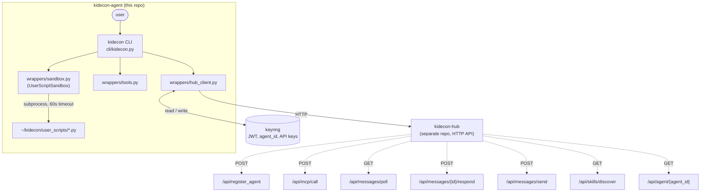

# Architecture

KidEconomy Agent is the user-facing, public repo: a thin CLI wrapper + Python library + install script. It is a **client sidecar** — no server, no database. It installs Hermes (from Nous Research), places the KidEconomy config, registers the agent with the hub, and provides approved local tools plus a sandboxed user-script executor.

## Client Topology

## Component Responsibilities

| Path                       | Role                                                                                |
|----------------------------|-------------------------------------------------------------------------------------|
| `kidecon.yaml`             | Default config: provider, hub_url, tool_gate (allow/deny/require_approval), update_channel, hermes_version. |
| `wrappers/__init__.py`     | Package marker; logger.                                                            |
| `wrappers/hub_client.py`   | `HubClient` — registers agent, stores JWT in keyring, calls hub MCP tools, polls/responds to messages, discovers skills, reads tier. |
| `wrappers/tools.py`        | Approved local tools: `file_read`, `file_append_markdown`, `message_user`. Workspace-scoped via `ALLOWED_BASE_DIR`. |
| `wrappers/sandbox.py`      | `UserScriptSandbox` — runs user scripts under `~/kidecon/user_scripts/` with 60s timeout + first-run approval gate. |
| `cli/__init__.py`          | Package marker; logger.                                                            |
| `cli/kidecon.py`           | Click CLI: `setup`, `start`, `stop`, `status`, `update`, `key` (add/list), `tier`, `skills` (list/browse). Thin orchestration only. |
| `install.sh`               | Bootstrap: venv, deps, place config, prompt OpenRouter key → keyring, install Hermes (stubbed), register agent → JWT → keyring. |
| `requirements.txt`         | Runtime + dev deps.                                                                |
| `pyproject.toml`           | ruff (kidecon rules minus `DJ`, target py311) + pytest config.                     |
| `skills/`                  | Community-contributed starter skills (see `skills/README.md`).                    |

## Data Flow

1. **Install** (`install.sh`): creates `env/`, installs deps, copies `kidecon.yaml` to `~/.config/kidecon/`, prompts for OpenRouter key -> keyring, runs `kidecon setup`.
2. **Register** (`kidecon setup`): `HubClient.register()` POSTs to `/api/register_agent`, stores JWT + agent_id in keyring.
3. **Run** (`kidecon start`): launches Hermes with KidEconomy config (stubbed).
4. **Tool call**: agent invokes an allowed tool — local (`wrappers/tools.py`) or hub (`HubClient.hub_call()` via `/api/mcp/call`).
5. **User script**: `UserScriptSandbox.execute()` runs a script from `~/kidecon/user_scripts/`; first run requires approval (recorded in `~/kidecon/.approved_scripts`); 60s timeout enforced.
6. **Messages**: `HubClient.poll_messages()` → `/api/messages/poll`; respond via `/api/messages/{id}/respond`; send via `/api/messages/send`.

## Secrets

All secrets live in the OS keyring under service `kidecon-agent`:
- `agent_id` — generated UUID, created on first use.
- `hub_jwt` — issued by hub on `register`.
- `api_key_<name>` — user-added API keys (e.g. `api_key_openrouter`).

No secret is ever written to disk or logged. `kidecon key list` masks all values.

## Safety Boundaries

- **Tool gate** (`kidecon.yaml` `tool_gate`): `allow` / `deny` / `require_approval` lists gate every tool invocation.
- **Workspace scoping**: `wrappers/tools.py` resolves paths and rejects anything escaping `~/kidecon/workspace`.
- **Sandbox isolation**: scripts run in `~/kidecon/user_scripts/` only, 60s timeout, no shell interpolation, args passed as a list.
