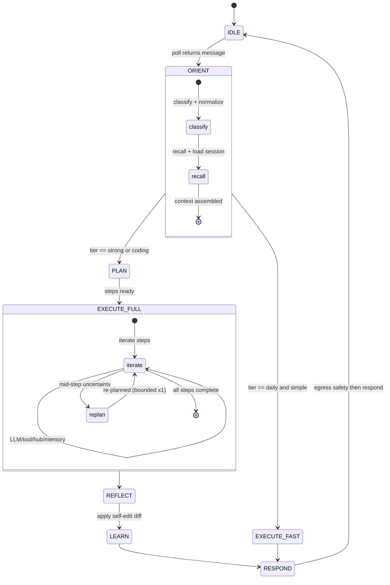
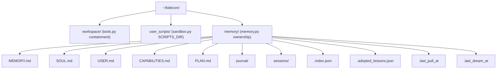
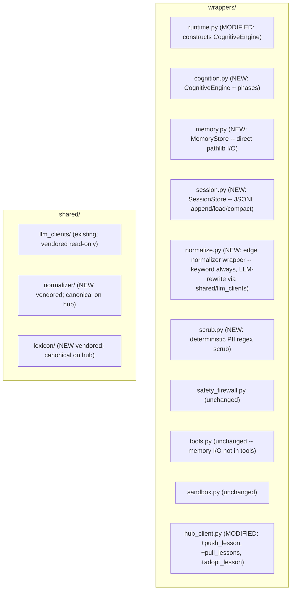

# Hermes Cognitive Architecture (Edge)

**Status:** Implementation-Ready Spec (docs only -- no code this session)
**Audience:** the next session, which builds Phases C1-C6 from this document.
**Scope:** the edge (`kidecon-agent`). The hub knowledge store this agent talks to is specified separately in `kidecon-hub/docs/HUB_KNOWLEDGE_STATE_MACHINE.md`. The edge<->hub contract is that doc's endpoint table (section 5), referenced here in section 9.
**What this replaces:** the linear `_process_message` pipeline in `wrappers/runtime.py:147` becomes a stateful per-turn cognitive engine. The outer `run_forever` poll loop (`runtime.py:78`) is unchanged.

**Constraints honored (AGENTS.md + session brief):**
- Edge compute is free (user-billed OpenRouter key); **latency** is the edge budget. No hub call for reasoning.
- No server, no database on the edge (AGENTS.md section 1). Memory is Markdown + JSON on the laptop.
- Secrets in OS keyring only; config in `kidecon.yaml`.
- No mid-turn tool-calling agent loop on the edge (deferred; would be the alternative self-edit path). Reflection runs **after** the turn, tier-gated.
- No LangChain on the edge. Hub-side LangChain remains orthogonal.
- Uniform non-staff access (AGENTS.md section 4.1). The agent never branches on user age; staff (hub tier 3) is the only elevated path and elevation is server-side, not edge-decided.

---

## 0. What exists today (the baseline we extend, not replace)

| Mechanism | Where | Status |
|---|---|---|
| Poll -> ingress safety -> tier resolve -> LLM -> uncertainty escalate -> egress safety -> respond | `wrappers/runtime.py:147` `_process_message` | Built, **stateless** |
| `BaseLLMProvider.complete()` / `.complete_structured(messages, model, response_schema, temperature)` | `shared/llm_clients/base.py` | Built, edge-routed via user key |
| `TierRouter.resolve_tier(message)` -> `daily` / `strong` / `coding` | `shared/llm_clients/tiers.py:25` | Built |
| LLM factory (OpenRouter / Together / DeepSeek) | `shared/llm_clients/factory.py` | Built |
| Safety firewall (ingress/egress LLM, fail-closed) | `wrappers/safety_firewall.py` | Built |
| `HubClient` (register/poll/respond/send/discover/manifest/admin/submit_skill) | `wrappers/hub_client.py` | Built |
| Local tools (`file_read`, `file_append_markdown`, `message_user`), workspace-scoped | `wrappers/tools.py` | Built |
| `UserScriptSandbox` (subprocess, 60s timeout, first-run approval) | `wrappers/sandbox.py` | Built |
| MCP manifest pull on boot | `runtime.py:102` `discover_manifest()` | Built |

**The three cognitive mechanisms that exist today:** tier-based routing, uncertainty escalation, the basic loop. Everything below is new and layered **on top** of these, gated by the tier that already exists. We do not invent a fourth tier.

---

## 1. Design principles

1. **Cognition is tiered.** `daily` stays fast (~ today: heuristic ORIENT + one LLM, no REFLECT). `strong` (`/think`) and `coding` (`/code`) run the **full cognitive cycle**. The existing `TierRouter` is the single switch -- no new router.
2. **Recall is local and instant.** Memory lives in local Markdown + a tiny JSON keyword/tag index. Recall = read file slices (microseconds), never a hub call and not an LLM call. No vector DB on the edge, no embedding model on the laptop.
3. **Reflection is an edge LLM call, not a hub call.** Compute is free (user key); we spend it after the response, never on the hub.
4. **Persona is identity, persisted in always-on blocks.** The persona survives restart because it lives in files (`SOUL.md`/`USER.md`/`CAPABILITIES.md`), not in the process. This is the Letta/MemGPT block model, ported native (see build-vs-wrap decision in section 4.6).
5. **The hub stores, routes, curates -- it never reasons and never reads raw memory.** The edge pushes only PII-scrubbed `summary` digests the agent **chooses** to share; the hub's `filtered`/`filter_reason` flags are a structured-field backstop. Edge deterministic regex scrub is the real PII line (section 8.1).
6. **Normalization is a sidecar, never a gate.** A keyword/lexicon match runs on every turn (instant, free) and feeds routing/tagging/skill-selection. It augments cognition; the safety firewall is the actual gate. The LLM always reasons on **raw** text (preserves user voice -> persona).
7. **Adoption is user-approved, never silent.** Network lessons surface as a suggestion; the user approves each. Normie trust + the "telemetry over surveillance" posture.

---

## 2. Cognitive faculties (what an agent *has*)

| Faculty | Responsibility | Where it runs | Cost |
|---|---|---|---|
| **Perception (ORIENT)** | Classify an incoming turn (intent, complexity, emotion, `needs_tool`, `needs_memory`, suggested tier) + run the normalization sidecar + recall + load session tail | Edge, **before** the reasoning LLM | <= 1 fast structured LLM call on `strong`; **pure heuristic + keyword normalization** on `daily` (0 LLM) |
| **Recall (memory)** | Surface relevant slices of `MEMORY.md` for the current turn; always load core blocks (`SOUL`/`USER`/`CAPABILITIES`) | Edge, local file read + `.index.json` | ~0 (file I/O) |
| **Working memory** | Bounded conversation context per session (last K turns) | Edge, in-process `SessionStore` + on-disk JSONL tail | 0 (RAM) / ~0 (file) |
| **Planning (PLAN)** | Decompose a complex turn into ordered steps | Edge, `strong`/`coding` only | 1 LLM call |
| **Acting (EXECUTE)** | Run the plan: LLM calls, `hub_call()`, local tools, memory writes. `user_script` steps require hub tier >= 2 (Bot Master). | Edge | variable (user key) |
| **Reflection (REFLECT)** | After the turn: self-critique the response, extract a learning, and **self-edit** persona/human/memory blocks | Edge, `strong`/`coding` only | 1 LLM call |
| **Learning (LEARN)** | Apply the REFLECT diff: append/trim `MEMORY.md`, update index, fold `prompt_improvement` into `SOUL.md`; optionally push a Lesson | Edge, local | ~0 (file I/O) |
| **Dreaming (consolidation)** | Idle/nightly job: review recent journals + `MEMORY.md`, produce a local digest, prune journals | Edge, separate from the poll loop | 1 LLM call (no hub push) |
| **World model** | MCP manifest (boot-pulled), `USER.md`, adopted Lessons folded into `SOUL.md`, live `tool_gate` | Edge, loaded on boot/refresh | 0 (already-pulled data) |

The "world model" is not a separate store; it is the union of (a) the MCP manifest (`runtime.py:102`), (b) `USER.md`, (c) adopted Lessons folded into `SOUL.md` prompt fragments, and (d) the live `tool_gate` allowlist in `kidecon.yaml`. The agent re-orients against this set every turn.

---

## 3. The cognitive cycle (data flow & state machine)

Replaces the linear `_process_message` with a stateful per-turn engine. The **simple path** (most `daily` traffic) collapses to ~ today's behavior for latency.

### 3.1 State machine (per incoming message)



Per-turn canonical transition: `IDLE -> ORIENT -> [PLAN -> EXECUTE -> REFLECT -> LEARN] -> RESPOND -> IDLE`. Bracketed phases are skipped on `daily`+simple.

### 3.2 Phase contracts (what each phase does, edge-only)

**ORIENT** -- `orient(message, memory, session) -> Context`
- **Normalization sidecar (runs every turn, including `daily`):** call `normalize.normalize_text(raw)` (vendored edge copy, see section 10). The **keyword/fuzzy lexicon match always runs** -- it is instant and free, resolves `domain_id`/`action_id`/`confidence`, and returns a `NormalizationResult` (`shared/normalizer` `NormalizationResult{raw_text, normalized_text, resolved_domain_id, resolved_action_id, confidence, ambiguity_candidates, source}`). This metadata feeds classification, routing, skill-selection, and memory tagging.
  - The **LLM-rewrite path** is **opt-in per tier** via `kidecon.yaml` `normalization.llm_rewrite_on: []` (default empty -> `daily` stays latency-parity). When enabled for a tier, it calls a separate function (`normalize_llm_rewrite(raw, model)` using `shared/llm_clients` factory) that runs exclusively after the keyword path succeeds. The edge vendored normalizer is **decomposed** into two functions: `normalize_keyword(raw)` (always runs, zero LLM) and `normalize_llm_rewrite(raw, model)` (only when tier in `llm_rewrite_on`, uses the user's OpenRouter key via `shared/llm_clients` factory). The hub's `services/normalizer.py` `normalize_text()` (which always calls `_llm_normalize`) remains as-is for hub skill-eval; the edge `shared/normalizer/` vendored copy exposes both functions.
  - The reasoning LLM (PLAN/EXECUTE) **always sees raw `text`** (preserves user voice -> persona). The normalized sidecar is **metadata**, stored alongside raw in the session JSONL line (section 5.3). Egress dispatches **raw** (full egress rewrite deferred -- v1 stores normalized alongside raw for search/metrics only).
- **Classify:** `{intent, complexity: simple|moderate|complex, emotion, needs_tool: bool, needs_memory: bool, suggested_tier}`. For `daily`+simple this is a **pure heuristic** (regex/keyword + the existing `TierRouter`) -- zero LLM. For `strong`, one structured `complete_structured` call on the `daily` model (cheap, fast).
- **Recall:** keyword/substring lookup against ORIENT's classification cues in `memory/.index.json` -> read matching `MEMORY.md` line ranges (bounded top-K). Always load the head of `SOUL.md`, `USER.md`, `CAPABILITIES.md` (the always-on core blocks, section 4).
- **Session:** load last K turns for this `(source, channel)` from the on-disk JSONL tail (`session_window`, default 12). Only human sources (Discord) get persistent sessions; A2A stays stateless.
- **Output:** `Context = {classification, normalization, recall_block, session_history, suggested_tier, active_plan}`.

**PLAN** -- `plan(context) -> list[Step]`  *(strong/coding only)*
- One `strong`-model structured call returning a JSON list of steps. Each `Step = {action, params, rationale}` where `action` is one of `{llm, hub_call, local_tool, memory_write, message_user, recall_more, user_script}`.
- Simple turns yield a single `llm` step (degenerate plan). Complex turns yield a multi-step recipe. The active plan is written to `memory/PLAN.md` (scratch, mutable) so a multi-message task can resume.
- Bounded replan: if EXECUTE hits mid-step uncertainty (today's `_has_uncertainty` at `runtime.py:34`), escalate the **current step** to the `strong` model; if still uncertain and tier was `daily`, re-enter PLAN **once**.

**EXECUTE** -- `execute(steps, context) -> (result, trace)`
- Iterate steps. Each action dispatches:
  - `llm` -> `factory.complete(...)` (today's `_call_llm`)
  - `hub_call` -> `client.hub_call(tool, params)` (MCP gateway `api/mcp_gateway.py`)
  - `local_tool` -> `wrappers/tools.py` (`file_read`/`file_append_markdown`/`message_user`)
  - `user_script` -> `wrappers/sandbox.py` `UserScriptSandbox` (coding tier; first-run approval per AGENTS.md section 4.2)
  - `memory_write` -> append to `MEMORY.md` + update index. Memory writes bypass `tools.py` and use dedicated `memory.py` logic writing directly to `~/kidecon/memory/` via `pathlib` (the `memory/` directory is outside `tools.py`'s `workspace/` containment, so memory I/O lives in `wrappers/memory.py`, not `file_append_markdown`).
  - `recall_more` -> re-query the index with refined keywords (loop back into context)
- `trace` records each step's input/output/rationale (for REFLECT and audit). The trace records action/params/output/rationale **only** -- it never includes system-prompt block text (SOUL/USER/CAPABILITIES bodies), preventing persona extraction via REFLECT.

**REFLECT** -- `reflect(message, result, trace) -> ReflectionDiff`  *(strong/coding only; `reflect_on_daily: false`)*
- One `strong`-model structured call returning:
  ```json
  {
    "quality": 0.0,
    "critique": "string",
    "keep": ["local memory lines to append (PII-free; use placeholder names like 'User X')"],
    "self_edit": {
      "persona": "optional replacement text for SOUL.md persona block (<= soul_limit chars)",
      "human":  "optional replacement text for USER.md human block (<= user_limit chars)",
      "memory": ["optional MEMORY.md lines to append/trim"]
    },
    "lesson": {
      "kind": "prompt_improvement | pattern | skill_proposal | tool_pattern | reflection",
      "title": "string (PII-free; use placeholder names)",
      "summary": { "what": "", "why": "", "how_to_use": "", "example_before": "", "example_after": "", "tier_hint": "daily|strong|coding" },
      "tags": [],
      "is_network_useful": false
    }
  }
  ```
- `self_edit` is the **Letta/MemGPT self-edit** + **Mem0 "extract after interaction"** phase, done tier-gated and **after** the turn (not a mid-turn tool-calling loop -- respects "no agent loop on edge"). The engine **applies** the diff in LEARN, enforcing char limits (section 4.1).
- `lesson` is optional and only set when `is_network_useful`. The REFLECT prompt explicitly forbids PII (names, emails, phone numbers, IDs) in `keep`, `title`, and all `summary` fields; it instructs the model to use placeholder names ("User X", "the customer"). The edge deterministic scrub (section 8.1) + hub `filter_message_payload` are backstops. **Architectural anti-extraction guard:** REFLECT's input `{message, result, trace}` never includes the SOUL/USER/CAPABILITIES block text -- the trace records only action/params/output/rationale, never the system prompt payload.

**LEARN** -- `learn(reflection) -> None`
- Append `keep` lines to `MEMORY.md` under a tagged `## [tag]` section; update `memory/.index.json` (`tag -> [[start_line, end_line]]`).
- Apply `self_edit`: replace the persona/human block bodies if provided and within `*_limit` (truncate-or-reject when over -- R3); append/trim `memory` lines.
- If `lesson` present and `is_network_useful`: scrub (section 8.1) -> `client.push_lesson(...)` (new `HubClient` method -> hub `POST /api/lessons`). Wrap in `try/except`; a failed push never breaks the turn. Push is automatic when `auto_push_lessons` is true (default); when false, lessons accumulate locally and the user is prompted on the next human turn. On successful push, write a notice to `messages.log` and surface "Shared 1 lesson with the network" in the next turn's context preamble so the user knows what was shared. Pushed lesson IDs are tracked in `memory/.pushed_lessons.json` so they are not re-pushed.
- `prompt_improvement` lessons are folded into local `SOUL.md` (LEARN), not pushed.

**RESPOND** -- unchanged from today: egress safety (Discord) -> `client.respond_to_message(...)`. Reflection writes only happen for turns that have already cleared egress.

### 3.3 Tier -> cycle mapping (latency budget)

| Tier | Cycle | Extra LLM calls vs. today | Latency delta |
|---|---|---|---|
| `daily` (simple) | ORIENT(heuristic + keyword normalization) -> EXECUTE(1 LLM) -> RESPOND | +0 | ~0 |
| `daily` (uncertain -> escalate) | ORIENT -> EXECUTE(daily) -> escalate EXECUTE(strong) -> RESPOND | +0 (today already does this) | ~0 |
| `strong` (`/think`) | ORIENT(1 LLM, +optional norm LLM-rewrite if configured) -> PLAN(1) -> EXECUTE(>=1) -> REFLECT(1) -> LEARN -> RESPOND | +3 (plan/orient/reflect) | +3-9s (acceptable: user asked for deep) |
| `coding` (`/code`) | `strong` cycle + `coding`-model in EXECUTE + `user_script` steps. **Gated:** agent hub tier >= 2 (Bot Master). | +3 | +3-9s |
| `coding` denied (tier 1) | ORIENT -> EXECUTE(daily) -> RESPOND with message: "`/code` requires Bot Master access (your tier: 1). Learn more or request an upgrade." | +0 | ~0 |

**The architecture is the same; depth is a tier knob that already exists.** The coding gate is an additional edge-side check: `TierRouter.resolve_tier()` may return `coding`, but the engine downgrades to `daily` if `agent_hub_tier < 2`. `/think` (strong) is available to all tiers -- it is deeper LLM reasoning only, no code execution.

---

## 4. Stateful persona & memory (the 4-pillar model)

This is the heart of the spec. The persona persists because it lives in files, not in the process. The model is ported from **Letta/MemGPT** (always-on blocks + self-edit + compaction + dreaming) and **Mem0** (extract-after-interaction + 4-layer taxonomy), **not invented**. See the build-vs-wrap decision in section 4.6 for why we build native rather than wrap a library.

### Pillar 1 -- always-in-context core blocks

Three Markdown files, each with a `description:` YAML frontmatter line (Letta: the description is the main cue the agent uses to read/write the block), each **always prepended** to the system prompt, each bounded by a char limit (Letta recommends <= ~5k each):

- **`SOUL.md`** = the `persona` block. Identity, values, voice. Rarely edited; loaded verbatim into the system prompt tail (after the base `system_prompt`).
- **`USER.md`** = the `human` block. User model: name, goals, preferences, history signals. Head always loaded.
- **`CAPABILITIES.md`** = a **distilled always-on block** of what the agent can do (a hand-maintained summary of available tools/skills/lessons -- maintained alongside the spec like SOUL/USER, **not** a runtime spec-introspection). Keeps capabilities in context without being heavy.

Frontmatter format (all three blocks share it):
```markdown
---
description: "The agent's core persona, voice, and values. Edit when the agent's character should shift."
limit: 5000
---
# Soul
You are warm but direct. You teach by asking, not by lecturing.
Never promise outcomes you can't verify.
```
The engine reads `limit` from frontmatter and **enforces it** in REFLECT (section 4.3 R3): a `self_edit.persona` over `limit` is rejected (or truncated to the limit), never silently accepted.

### Pillar 2 -- agent self-edits its blocks via REFLECT

The post-turn REFLECT phase (strong/coding only; `daily` = read-only) emits a structured `self_edit` diff `{persona?, human?, memory?}` (section 3.2). The engine **applies** it: replace the block body if within `limit`, else reject. This is Mem0's "extract after interaction" + Letta's self-edit, done tier-gated. No mid-turn tool-calling loop on the edge.

### Pillar 3 -- persisted message history + compaction

- Per-session **append-only JSONL** at `~/kidecon/memory/sessions/<source>_<discord_id>.jsonl` (line schema in section 4.3). Only human (Discord) sources get persistent sessions; A2A stays stateless.
- On each turn, load the last K (`session_window`, default 12) lines into context.
- When a session exceeds `compaction_threshold` turns, **summarize the oldest** into `MEMORY.md`/`USER.md` and **prune the JSONL to a short head**. This is Letta's compaction pattern: keeps the always-loaded tail bounded **without losing persona** (persona lives in the blocks, not raw history).

### Pillar 4 -- dreaming (sleep-time compute)

Idle/schedule-triggered background pass reviews recent journals + `MEMORY.md`, writes lessons, prunes journals. Runs as a **separate path from the poll loop** -- kicked only when the poll loop is idle (>= `dream_idle_cycles` empty polls) or on a daily schedule. It never blocks message processing and never mutates files concurrently with a turn (simpler than Letta's git-worktree concurrency). Dreaming produces a local digest only -- **no hub push**. Cognitive-summary sharing is deferred to a future discrete-intelligence algorithm; the system must not collect agent thoughts on the hub until a safe sharing protocol is designed. Full spec in section 6.

### 4.5 Mem0 4-layer mapping

| Mem0 layer | Our artifact | Where |
|---|---|---|
| **Conversation** | in-flight turn (ephemeral) | in-process `Context` |
| **Session** | JSONL log + recent tail | `~/kidecon/memory/sessions/*.jsonl` |
| **User** | `USER.md` + `MEMORY.md` (long-lived) | `~/kidecon/memory/` |
| **Org** | hub `Lesson` store (shared across agents) | `kidecon-hub` (see hub doc) |

### 4.6 Build-vs-wrap decision (recorded so the next session doesn't re-litigate)

**Build the persona/memory layer native in `kidecon-agent`, porting the Letta/MemGPT block model.** No true drop-in persona library exists today:
- **Mem0** (OSS, `pip install mem0`) solves *memory* (4-tier extract+retrieve+dedup) but **not persona-as-identity** (no `persona` block); needs a vector store on the laptop -> violates "no DB on edge" + adds deps; overkill for our keyword-index design.
- **Letta** (OSS server) is the canonical persona reference (persona+human always-on blocks, self-edit, compaction, dreaming) but is a **server+Postgres, not an edge lib**; you can't `pip install` its persona loop into a poll-loop agent; its V2 SDK is TypeScript-only. Value = patterns to port, not code to wrap.

Our 4-pillar design ports the patterns. Do not re-evaluate wrapping unless an edge-native persona library ships.

---

## 5. Edge memory file layout (under `~/kidecon/`, all local)

```
~/kidecon/
  workspace/                  # existing (tools.py ALLOWED_BASE_DIR)
  user_scripts/               # existing (sandbox.py SCRIPTS_DIR)
  memory/                     # NEW -- owned by memory.py, outside tools.py containment
    MEMORY.md                 # archival episodic + semantic log (APPEND-ONLY)
    SOUL.md                   # persona block (frontmatter + body; always-on)
    USER.md                   # human block (frontmatter + body; always-on)
    CAPABILITIES.md           # distilled capabilities block (frontmatter + body; always-on)
    PLAN.md                   # current active plan (mutable scratch; multi-turn tasks)
    journal/                  # per-day reflection journals (append-only)
      2026-07-08.md
    sessions/                 # per-session JSONL message history (append-only; Discord only)
      discord_<discord_id>.jsonl
    .index.json               # local keyword/tag -> MEMORY.md line-range map
    .adopted_lessons.json     # lesson_ids already adopted (de-dupe pulls)
    .pushed_lessons.json      # lesson_ids already pushed (de-dupe pushes)
    .last_pull_at             # ISO timestamp of last lesson pull (pull-since cursor)
    .last_dream_at            # ISO timestamp of last dream cycle
  messages.log                # existing
```

`workspace/` and `user_scripts/` remain under the existing `tools.py` containment (`ALLOWED_BASE_DIR = ~/kidecon/workspace` and `SCRIPTS_DIR = ~/kidecon/user_scripts`). The new `memory/` directory and all its subpaths are **outside** `tools.py` containment -- memory I/O is handled directly by `wrappers/memory.py` via `pathlib` (the `memory_write` action bypasses `file_append_markdown`). The `tools.py` allowlist does **not** need modification.



### 5.1 Frontmatter + char limits

Every core block (`SOUL`/`USER`/`CAPABILITIES`) begins with a YAML frontmatter block:
```yaml
---
description: "<one-line cue the agent uses to decide when to read/write this block>"
limit: 5000
---
```
`*_limit` defaults: `soul_limit` 5000, `user_limit` 5000, `capabilities_limit` 3000 (configurable in `cognition.*`, section 11). REFLECT must respect `limit`; C2 test asserts rejection/truncation when `self_edit.persona` exceeds `soul_limit`.

### 5.2 File formats

**MEMORY.md** -- append-only, sectioned by tags:
```markdown
# Memory

## [user-prefs]
- Prefers concise answers. (2026-07-08, src: reflection)

## [pattern:scheduling]
- When the user asks "is X free", they usually want the next 3 slots. (2026-07-08, src: lesson)
```
Each entry: a bullet line ending with `(YYYY-MM-DD, src: <reflection|lesson|observation|compaction>)`.

**PLAN.md** -- mutable; one active plan:
```markdown
# Active Plan
task: "Set up a weekly reminder for the user's standup"
steps:
- [x] hub_call scheduling.availability
- [ ] message_user "Confirm 9am Mondays?"
status: in_progress
created: 2026-07-08T14:00Z
```

**.index.json** -- the cheap recall index (no embeddings, no LLM):
```json
{
  "user-prefs": [[3, 5]],
  "pattern:scheduling": [[7, 8]],
  "tags_by_recency": ["pattern:scheduling", "user-prefs"],
  "last_entry_line": 8
}
```
Recall: match tags by keyword/substring against the classification's `intent` + `needs_memory` cues -> read those line ranges from `MEMORY.md`. Bounded top-K (default 5 sections, <= ~400 tokens). This is the entire "semantic search" -- deliberately dumb, deliberately fast.

**.adopted_lessons.json**:
```json
["<uuid>", "<uuid>"]
```

**.last_pull_at / .last_dream_at**: a single ISO-8601 string each, e.g. `2026-07-08T18:00:00Z`.

### 5.3 Session JSONL line schema

`memory/sessions/discord_<discord_id>.jsonl` -- one JSON object per line, append-only:
```json
{"ts": "2026-07-08T18:00:00Z", "role": "user", "text": "is the user free friday?", "tier": "daily", "msg_id": "<uuid>", "norm": {"domain_id": "scheduling", "action_id": "availability", "confidence": 0.9, "source": "keyword"}}
{"ts": "2026-07-08T18:00:02Z", "role": "assistant", "text": "The user is free Fri 9-10am...", "tier": "daily", "msg_id": "<uuid>"}
```
- `text` is **raw** (the reasoning LLM saw raw; egress dispatches raw). `norm` is the ORIENT normalization sidecar metadata, stored alongside for search/metrics. `norm.source` reflects whether an LLM-rewrite actually ran (`"keyword"` when no rewrite, `"llm_keyword"` when the opt-in LLM-rewrite path executed).
- Load last `session_window` lines into context each turn. Compaction (Pillar 3) summarizes the oldest beyond `compaction_threshold` into `MEMORY.md`/`USER.md` and prunes the file to a short head.

### 5.4 Working memory (in-process, not a file)

`SessionStore` in `wrappers/runtime.py`: `dict[session_key, deque[(role, text), K]]` where `session_key = (source, discord_user_id | channel_id)`. Evict entries older than `session_stale_minutes` (default 30). Feeds ORIENT. Persists across poll cycles, lost on restart (acceptable; long-term memory is in files, and persona survives restart via the blocks). The on-disk JSONL tail re-seeds working memory on the first turn after a restart.

---

## 6. Dreaming & consolidation (edge job, local only)

**Trigger:** when the poll loop has been idle for >= `dream_idle_cycles` (default 20 empty polls ~10 min) **or** on a daily schedule from `kidecon.yaml`. Runs as a **separate path** -- never blocks the poll loop, never mutates memory files concurrently with an in-flight turn (run only when idle).

**Dream cycle (edge LLM, one call -- local only, no hub push):**
1. Read all `memory/journal/YYYY-MM-DD.md` for the period not yet summarized + recent `MEMORY.md` entries.
2. One `strong`-model structured call -> `digest = {conversations: int, ideas: [...], domains: [...], highlights: [...], lessons_pushed: [...]}`. The digest is stored locally only.
3. Local: prune journal entries older than `dream_retention_days` (default 14) once summarized; keep `MEMORY.md` (the durable log).
4. Mark `memory/.last_dream_at`.

**No hub push.** Cognitive summaries (the digest produced by dreaming) are not shared with the hub. The system must not collect agent thoughts or cognitive traits on the hub until a safe sharing protocol is designed. Future intelligence sharing will use discrete, purpose-built telemetry and Lesson-push channels, not raw dream digests.

---

## 7. Code execution & skill submission

### 7.1 Code execution (`/code` tier) -- Bot Master gated (hub tier >= 2)

The `/code` tier and all `user_script` execution are **gated behind hub tier >= 2 (Bot Master)**. Tier 1 agents receive a downgrade message explaining the requirement; `/think` (strong) remains available to all tiers.

**`/code` tier writes `user_scripts/`** for tasks the hub can't do. `EXECUTE` `user_script` steps dispatch to `wrappers/sandbox.py` `UserScriptSandbox` (isolated subprocess, 60s timeout, first-run approval per AGENTS.md section 4.2/4.4). Scripts live under `~/kidecon/user_scripts/` (per `sandbox.py` `SCRIPTS_DIR`). Edge checks `agent_hub_tier >= 2` before routing to the coding-model EXECUTE path; tier 1 agents get a message explaining the requirement.

### 7.2 Skill submission -- available to all tiers

Skill submission is a JSON proposal only -- it does not execute code on the user's box. Available to all tiers.

The agent submits a `skill` to the hub -> hub evaluates via the existing `SkillEvaluationPipeline` + `services/normalizer.py` -> staff approves -> either deploys as a hub tool **or** pushes to the agent codebase (existing `services/skills_repo.py:push_skill_to_repo`, currently pushes JSON to a GitHub repo). Edge entry point: `HubClient.submit_skill(...)` (already built, `hub_client.py:234`).

**Future alignment (deferred, recorded not decided):** the agentskills.io SKILL.md standard (Anthropic-origin, 3-stage progressive disclosure: Discovery ~100 tokens -> Activation full body -> Execution bundled scripts). This **conflicts with the hub's current `Skill` model** (`models.py:50`, JSON `definition` with input/output JSON Schema = the **MCP tool** shape, not the **agent skill** shape). The hub conflates two different artifacts. Deferred: keep JSON `Skill` as-is for now; `skill_proposal` Lessons mature into it. Splitting `Skill` vs `AgentSkill` to align with agentskills.io is a separate future decision for cross-client portability. Do not conflate in this build.

---

## 8. Safety & access control

### 8.1 Edge PII scrub before any push (the real PII line)

Before `push_lesson`, run a **deterministic regex scrub** over the payload: redact email, phone, and obvious IDs (regex set in `wrappers/scrub.py`). The hub's `filter_message_payload` is a **structured-field backstop only** -- the existing `_redact_dict` (`services/safety.py:58`) is **key-name-only** (matches field names, not values), so free-text PII in payload **values** passes through the hub filter. The edge scrub is therefore the **real PII line**; the hub filter catches structured-field leaks only. The hub push path has **no hub-side value-PII enforcement** in phase C3; that requires future value-pattern redaction (tracked separately). The edge scrub is a hard build dependency of the push path.

**Persona examples must use placeholder names.** The REFLECT prompt instructs the model to use placeholder names ("User X", "the customer", "a client") in `summary.example_before`/`example_after` and `title`. The scrub regex (email/phone/IDs) is a backstop for leaked names but cannot guarantee name redaction in free text. C2 test asserts that pushed `summary` examples contain no real names (assert regex match on known name patterns from prompt injection).

### 8.2 Edge reflection guardrails

- The REFLECT prompt explicitly forbids PII (names, emails, phone numbers, IDs) in `keep`, `title`, and all `summary` fields; it instructs the model to use placeholder names.
- **Architectural anti-extraction guard:** REFLECT's input `{message, result, trace}` never includes SOUL/USER/CAPABILITIES block text. The `trace` records only action/params/output/rationale per step -- never the system prompt payload. This prevents persona extraction via REFLECT echoing into `self_edit` or `lesson.summary`.
- A failed `push_lesson` is logged and swallowed -- never breaks a user-facing turn.
- **"What safety measures are in place?"** (AGENTS.md section 4.5): the edge system-prompt tail gains a short, user-facing summary covering memory files (MEMORY/SOUL/USER/CAPABILITIES), the safety firewall on Discord traffic, the sandbox for user scripts with first-run approval, JWT authentication to the hub, network lesson sharing requiring explicit user approval, and the `filtered`/`filter_reason` transparency flags from the hub. Answerable through any agent interface at any time.

### 8.3 Ordering with the safety firewall

ORIENT runs **after** ingress safety (ingress stays first, as today). Egress safety stays last (RESPOND). Reflection/learning writes only happen for turns that have already cleared egress. Normalization is a **sidecar, not a gate** -- the safety firewall is the gate ("belt and suspenders": normalization is the language layer, filter is the safety layer).

---

## 9. Integration with existing systems

| Existing system | How cognition integrates | Change required |
|---|---|---|
| **TierRouter** (`shared/llm_clients/tiers.py:25`) + **hub tier** | The single switch selecting cycle depth. `daily`->simple, `strong`->full cycle. `coding`->full cycle **only if** agent hub tier >= 2 (Bot Master); downgrades to `daily` with explanation otherwise. | CognitiveEngine checks `agent_hub_tier` from boot-cached hub response. |
| **MCP gateway** (`api/mcp_gateway.py`) | EXECUTE's `hub_call` steps dispatch here. Tool outputs already filtered. | None. (Optional C6: add `knowledge.browse`/`adopt` tools.) |
| **Skills** (`api/skills.py`, `api/admin.py`) | `skill_proposal` Lessons mature into `Skill` rows via the existing submit->pending->live flow. Adopted `prompt_improvement` lessons fold into local `SOUL.md`. | Hub `api/admin.py` gains `promote_skill` (creates a Skill) -- see hub doc. |
| **A2A broker** (`api/broker.py`) | `discovery_broadcast` (documented message type, `FLOW_CONTROL.md` section 3.1) carries lesson-surfacing notifications on staff endorsement. Hub sends via `send_message`; on-wire envelope is `{role: "External_Agent", content: {lesson_id, title, kind}}` (per `structure_a2a_payload` wrapping). | Edge must unwrap `message.payload.content` to read `{lesson_id, title, kind}`. The broker accepts any `type` string (no change needed). |
| **Safety firewall** (edge, `wrappers/safety_firewall.py`) | Ingress first, egress last. REFLECT only on egress-cleared turns. | Ordering preserved. |
| **Hub filtering** (`services/safety.py`) | Lessons/summaries go through `filter_message_payload`; pulls through `filter_tool_result`. The hub doc specifies the centralized `filtered: true` / `filter_reason` fix (AGENTS.md section 4.2) for `filter_tool_result` + `filter_message_payload` read paths. `structure_a2a_payload` (send path) is deferred with the A2A contract mismatch. | Hub-side; this edge relies on it as structured-field backstop only (section 8.1). |
| **Local tools** (`wrappers/tools.py`) | EXECUTE `local_tool` steps use `file_read`/`file_append_markdown` (workspace-scoped). `memory_write` steps bypass `tools.py` and use `memory.py` directly (`pathlib` writes to `~/kidecon/memory/`). | `tools.py`: no change (workspace containment unchanged). New `memory.py` handles memory I/O directly. |
| **Sandbox** (`wrappers/sandbox.py`) | `user_script` EXECUTE steps (coding tier). Scripts at `~/kidecon/user_scripts/` (`sandbox.py` SCRIPTS_DIR). | None. |
| **Config** (`kidecon.yaml`) | New keys (section 11). | Append; defaults preserve current behavior. |
| **Normalizer** (hub `services/normalizer.py` + `system/skill_taxonomy.json`) | Vendored to the edge as `shared/normalizer/` + `shared/lexicon/` (section 10); runs as the ORIENT sidecar. Decomposed into two functions on the edge: `normalize_keyword(raw)` (always, zero LLM) and `normalize_llm_rewrite(raw, model)` (opt-in per tier via shared LLM factory). The hub `normalize.text` MCP tool + skill-eval use `services/normalizer.py` as-is. | New sync target (section 10). |
| **HubClient** (`wrappers/hub_client.py`) | New methods: `push_lesson`, `pull_lessons`, `adopt_lesson`, `pull_my_lessons`. | Add methods (interface specified by hub doc section 5 endpoint table). |

---

## 10. Edge code structure (new files in `wrappers/` + `shared/`)



**`runtime.py` change is minimal:** `_process_message` becomes `_engine.process(message)`. `CognitiveEngine` holds `factory, safety, models, memory, sessions, normalize, scrub, knowledge, system_prompt, provider, max_price`. The `run_forever` outer loop (poll/backoff/signal/shutdown + boot manifest pull at `:102`) is unchanged; it additionally seeds working memory from the on-disk JSONL tail on the first turn and triggers dreaming when idle.

### New shared-sync surfaces

- **`shared/normalizer/`** + **`shared/lexicon/`** are **canonical on the hub** (`kidecon-hub/services/normalizer.py` -> `shared/normalizer/`; `kidecon-hub/system/skill_taxonomy.json` -> `shared/lexicon/skill_taxonomy.json`), **vendored to the agent** via a new `make sync-lexicon` target that mirrors the existing `make sync-llm` (hub -> agent canonical pattern). The agent copy is **read-only** with the same ASCII warning banner as `shared/llm_clients/`. The hub's `services/normalizer.py` remains the canonical source and becomes a thin re-export shim of `shared.normalizer` (or stays as-is and sync copies from it; decided at build time).
- **`make check-lexicon-sync`** mirrors `check-llm-sync` to detect drift (R7).
- The **edge normalizer is decomposed** into two functions:
  - `normalize_keyword(raw: str) -> NormalizationResult` -- keyword/fuzzy lexicon match (always runs, zero LLM).
  - `normalize_llm_rewrite(raw: str, model: str) -> str` -- LLM-rewrite canonicalization (only when tier in `normalization.llm_rewrite_on`). Uses `shared/llm_clients` factory (user's OpenRouter key, provider-agnostic, zero hub cost).
- The hub's `services/normalizer.py` `normalize_text()` (which always calls `_llm_normalize`; gated on `OPENAI_API_KEY`) stays as-is for hub skill-eval; the edge vendored copy exposes both decomposed functions.

---

## 11. Config additions (`kidecon.yaml`, edge)

Additive only -- appended to the existing `llm:` and top-level sections. Defaults preserve current behavior (`cognition.enabled` can ship `false` then flip). The `cli/kidecon.py:init` defaults dict (line 170) gains these keys:

```yaml
cognition:
  enabled: true                 # master switch; false -> today's linear loop
  strong_cycle: true            # run full cycle on strong/coding tiers
  session_window: 12            # K turns of working memory loaded each turn
  session_stale_minutes: 30
  compaction_threshold: 60      # turns before oldest session lines are summarized + pruned
  recall_top_k: 5               # memory sections to load
  reflect_on_daily: false       # keep daily fast; only reflect on strong+
  soul_limit: 5000
  user_limit: 5000
  capabilities_limit: 3000
  dream_idle_cycles: 20         # empty polls before a dream
  dream_retention_days: 14
  auto_adopt_lessons: false     # NEVER auto-adopt; user approves each
  auto_push_lessons: true        # automatically push lessons to the hub; false = accumulate locally
normalization:
  llm_rewrite_on: []            # tiers that opt into LLM-rewrite sidecar; default [] keeps daily latency-parity
                                # e.g. ["strong","coding"] to enable on deep tiers
  model: "daily"                # model to use for LLM-rewrite (defaults to the daily tier model)
knowledge:
  pull_on_boot: true
  pull_on_idle: true
  pull_interval_minutes: 360
```

Note: `broadcast_on_endorse` is a hub-side flag (in hub `config.py`), not an edge config key. The edge honors incoming `discovery_broadcast` messages unconditionally when `pull_on_boot` or `pull_on_idle` is true; agents decide whether to pull.

---

## 12. Implementation phases (ordered, buildable -- the next session builds, this doc is the spec)

- **C1 -- Edge memory + cycle + stateful persona + normalization.** `memory.py` (persona/human/capabilities/archival blocks w/ frontmatter + limits), `session.py` (JSONL append + tail load + compaction), `cognition.py` (ORIENT incl. normalization sidecar decomposed into keyword/LLM-rewrite -> `NormalizationResult` for routing/tagging; EXECUTE/RESPOND; strong path adds PLAN/REFLECT self-edit/LEARN). Vendor `shared/normalizer/` + `shared/lexicon/` + `make sync-lexicon`; rewire edge normalizer LLM path through `shared/llm_clients`. Wire into `runtime.py`. **Tests:** daily latency-parity incl. keyword normalization (0 LLM); persona survives restart (two turns across a restart reuse SOUL/USER + session tail); normalized sidecar stored alongside raw in JSONL but LLM saw raw.
- **C2 -- Reflection self-edit + local learning.** REFLECT structured diff applied to SOUL/USER/MEMORY; edge PII scrub (including placeholder-name requirement in REFLECT prompt); anti-extraction guard (trace excludes persona blocks); failed push swallowed. **Tests:** reflection appends a tagged entry; `self_edit.persona` over `soul_limit` is rejected/truncated (R3); a simulated uncertain turn triggers replan x1; pushed `summary.example_before` contains no real names.
- **C3 -- Hub knowledge store + safety fix.** (Hub repo -- see hub doc.) `models.py` Lesson+LessonAdoption + Alembic; `api/knowledge.py` with `services/knowledge.py`; fix `filtered`/`filter_reason` in `services/safety.py` for `filter_tool_result` + `filter_message_payload` read paths; `FLOW_CONTROL.md` new sections.
- **C4 -- Edge<->hub wiring.** `HubClient` lesson/summary methods; boot/idle pull (`since` cursor); user-approved adoption CLI ("Peer agents found N useful patterns. Adopt?"). **Tests:** boot pulls since-cursor + de-dupe; adoption bumps hub counter; failed push doesn't break a turn.
- **C5 -- Dreaming + broadcast.** Edge idle dream (local summarize + prune only; no hub push); hub cron deprecates stale; staff endorse -> `discovery_broadcast`; agent honors once (unwraps `message.payload.content` to read `{lesson_id, title, kind}`). **Tests:** dream produces a local digest + prunes journals; endorsement emits a broadcast; agent surfaces it once.
- **C6 -- Polish/optional.** MCP tools `knowledge.browse`/`adopt`; optional embedding semantic search; `doctor` memory/knowledge checks (memory dir writable, last pull age, last dream age); `make check-lexicon-sync`; egress full-rewrite study; agentskills.io alignment study.

---

## 13. Validation (what "done" looks like)

- Daily call-count parity with today (keyword normalization adds 0 LLM calls).
- Strong turn produces a `trace` with PLAN + REFLECT.
- **Persona survives restart**: two turns across a restart reuse SOUL/USER + session tail (R-related: persona lives in files, not process).
- Normalized sidecar present in JSONL but the LLM saw raw text. `norm.source` reflects whether LLM-rewrite ran.
- Redaction + idempotent adopt (R2, R4). Pushed `summary` examples contain no real names.
- Cursor de-dupe; dream produces a local digest + prunes journals; broadcast surfaces once (R4, C5).
- `self_edit` respects `*_limit` (R3).
- `make check-lexicon-sync` passes (R7).

## 14. What this explicitly does NOT do (boundary discipline)

- No server, no database, no on-disk secrets on the edge (AGENTS.md section 1).
- No mid-turn tool-calling agent loop (deferred; reflection is post-turn).
- No auto-adoption -- every network lesson adoption is user-approved.
- No LangChain on the edge; no wrapping of Mem0/Letta (evaluated, rejected -- section 4.6).
- No egress full-rewrite normalization (deferred; v1 stores normalized alongside raw, dispatches raw).
- No age/COPPA branching -- uniform non-staff access (AGENTS.md section 4.1); staff (hub tier 3) is the only elevated path and is server-side.
- No adopting the agentskills.io SKILL.md standard now (deferred future decision -- section 7).