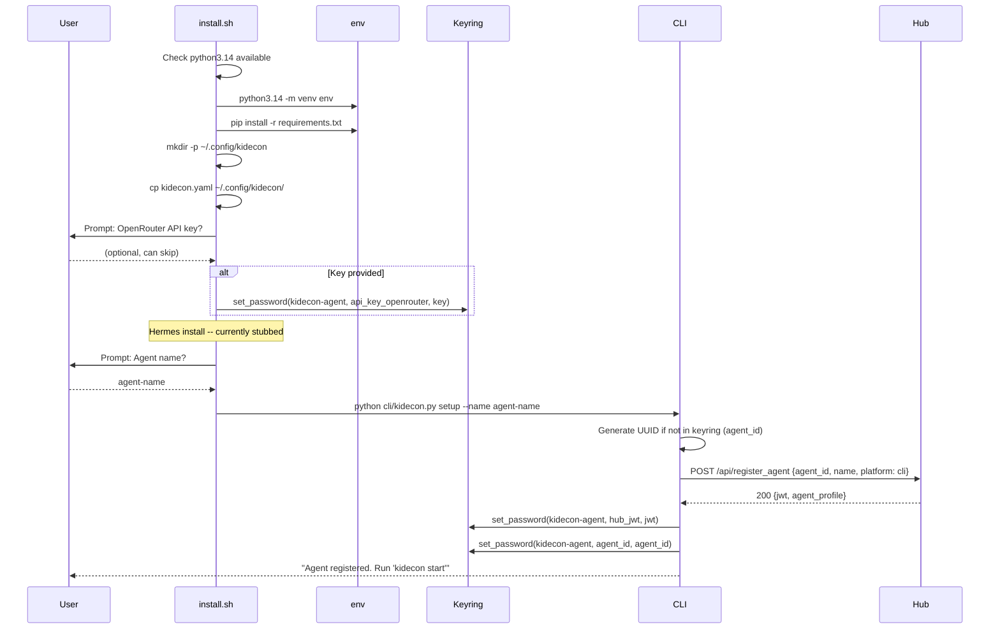
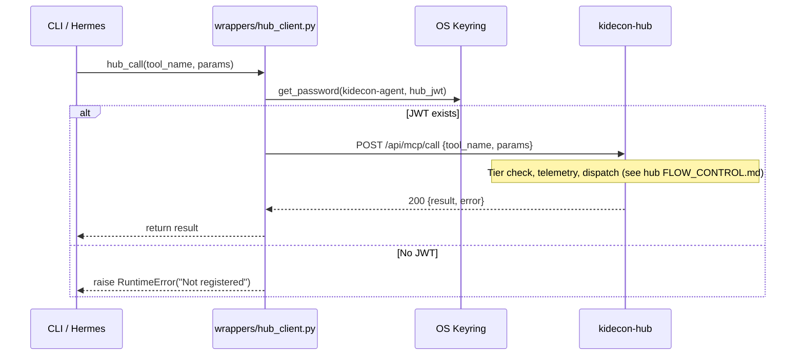
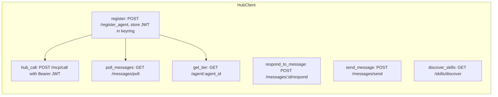
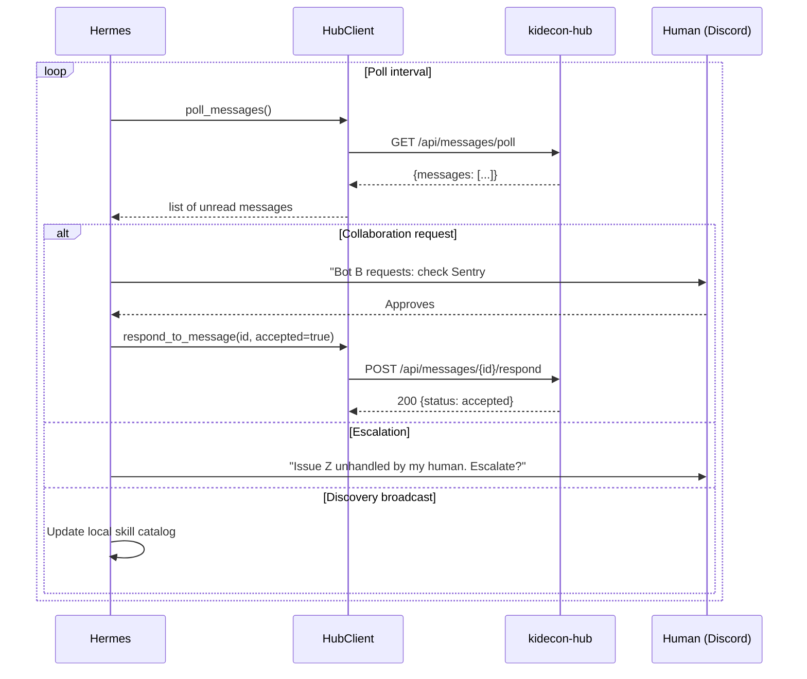
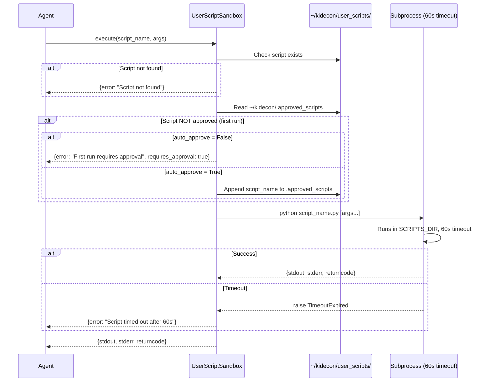
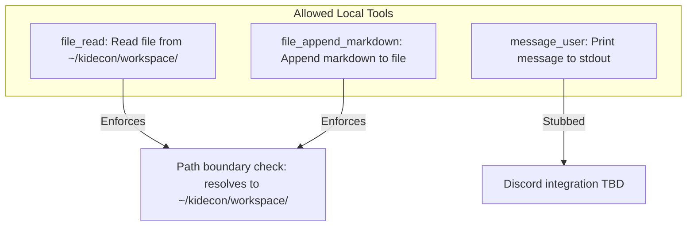
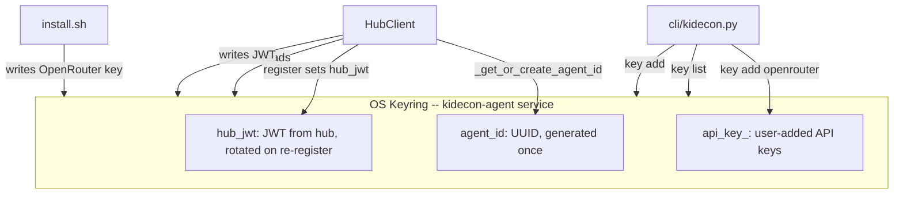
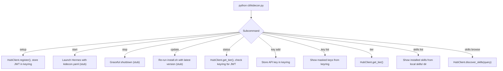
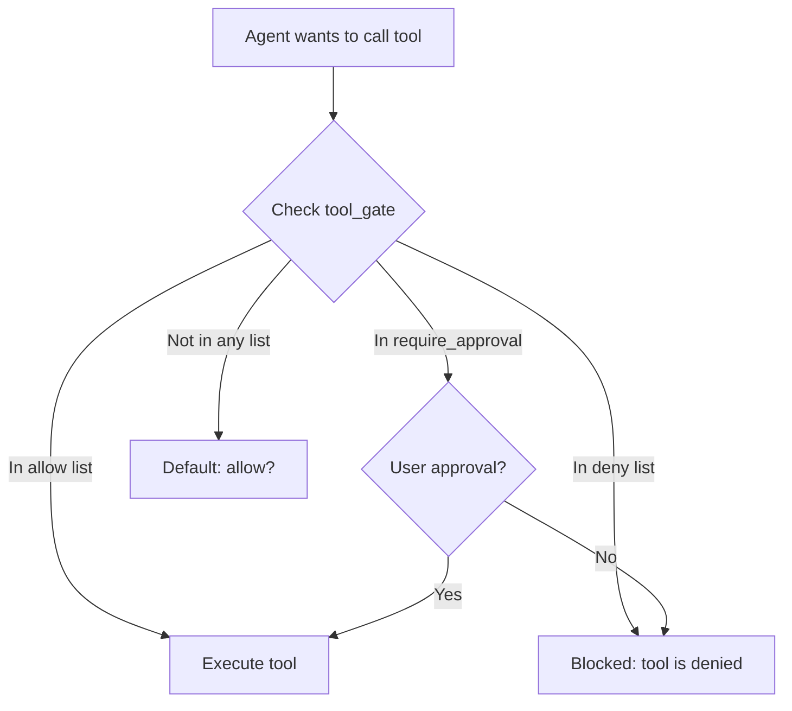

# System Flow Control & State Machines

## 1. Bootstrap: Install & Register

- `agent_id` is a UUID generated once and persisted in the OS keyring.
- Registration is idempotent: re-running `setup` re-registers with the same agent_id.
- OpenRouter key is optional during install; can be added later via `kidecon key add`.

---

## 2. HubClient Request Flow

### 2.1 HubClient: All Operations

- All authenticated operations read the JWT from keyring via `_auth_headers()`.
- If JWT is expired, the hub returns 401; the caller must re-run `register()`.

---

## 3. Message Poll & Respond Loop

- Poll interval is determined by Hermes configuration.
- Messages are marked `delivered` on poll; they are not re-delivered.
- Unresponded messages remain in the DB with `delivered` status.

---

## 4. User Script Sandbox Execution

### 4.1 Local Tools (wrappers/tools.py)

- `file_read` and `file_append_markdown` resolve and validate paths against `~/kidecon/workspace/`.
- Any path escaping the workspace boundary raises `PermissionError`.
- `message_user` is a stub; real implementation will route through Hermes/Discord.

---

## 5. Keyring & Secret Management

- All secrets live in the OS keyring, never on disk.
- `kidecon.yaml` contains no secrets; it is safe to commit.
- `install.sh` prompts for the OpenRouter key interactively and stores it via keyring.
- `kidecon key add` lets users add additional API keys post-install.

---

## 6. CLI Command Dispatch

- `load_config()` reads `kidecon.yaml` for `hub_url`.
- Commands marked `stub` are placeholders for Hermes integration.
- `skills browse` queries the hub's `/api/skills/discover` endpoint.

---

## 7. Tool Gate Configuration

The `kidecon.yaml` tool gate controls which tools Hermes is allowed to invoke:

- `allow`: Tools always permitted (file_read, file_append_markdown, hub_call, user_script_execute, message_user).
- `deny`: Tools always blocked (file_write_binary, shell_execute, file_delete).
- `require_approval`: First-time use requires explicit user confirmation (user_script_first_run, hub_collaboration_request).
- The tool gate is enforced by Hermes using this config; the Python wrappers do not enforce it themselves.

---

## 8. Key Code Paths

| Flow | Entry Point | Key Files |
|------|------------|-----------|
| Install & bootstrap | `bash install.sh` | `install.sh`, `cli/kidecon.py::setup` |
| Agent registration | `HubClient.register()` | `wrappers/hub_client.py`, OS keyring |
| MCP tool call | `HubClient.hub_call()` | `wrappers/hub_client.py::_auth_headers()` |
| Message poll | `HubClient.poll_messages()` | `wrappers/hub_client.py` |
| Message respond | `HubClient.respond_to_message()` | `wrappers/hub_client.py` |
| Skill discovery | `HubClient.discover_skills()` | `wrappers/hub_client.py`, hub `/api/skills/discover` |
| User script execution | `UserScriptSandbox.execute()` | `wrappers/sandbox.py` |
| File read (local) | `file_read()` | `wrappers/tools.py` |
| File append (local) | `file_append_markdown()` | `wrappers/tools.py` |
| Key management | `kidecon key add/list` | `cli/kidecon.py`, OS keyring |
| Tier check | `HubClient.get_tier()` | `wrappers/hub_client.py`, hub `/api/agent/{id}` |
| Config loading | `load_config()` | `cli/kidecon.py`, `kidecon.yaml` |